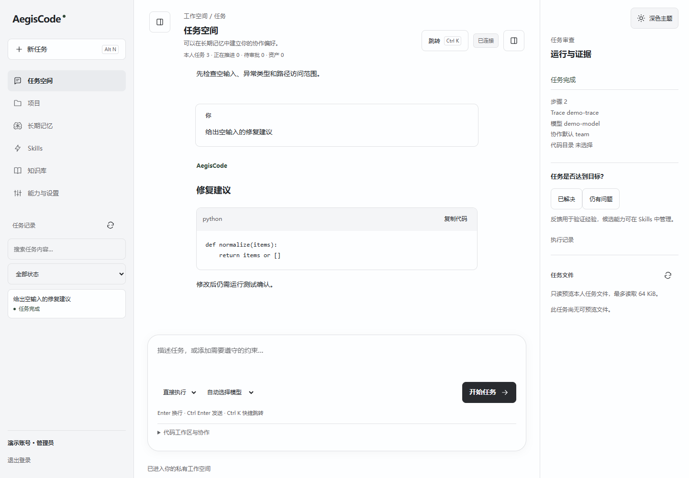
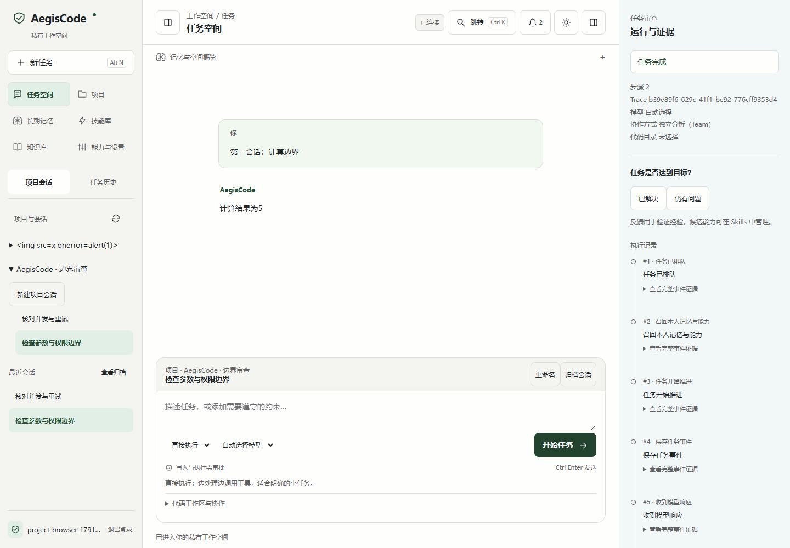
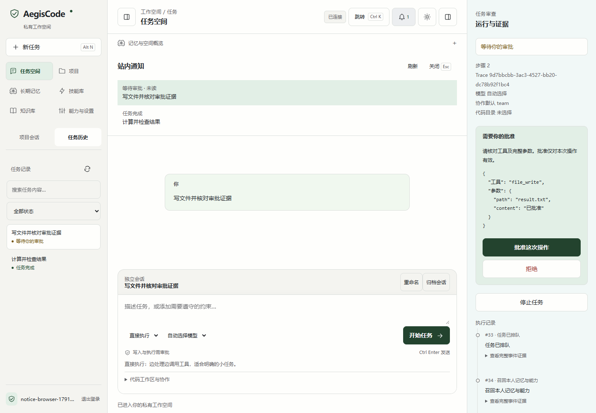
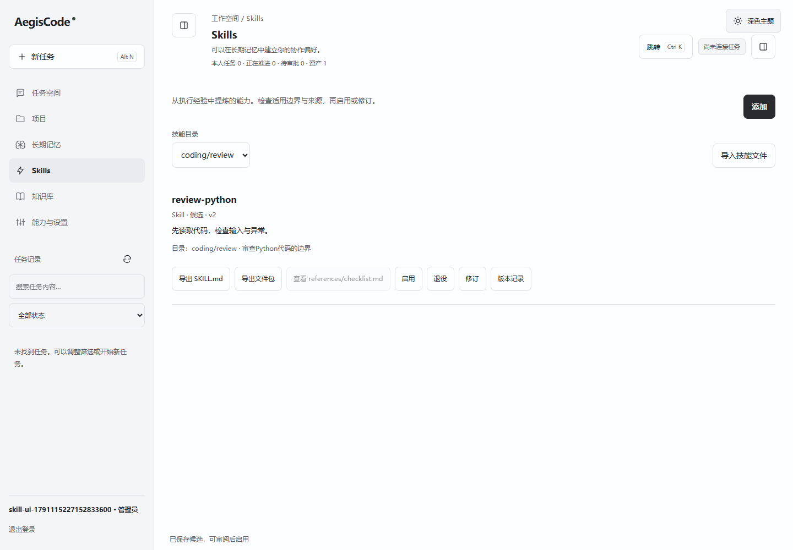
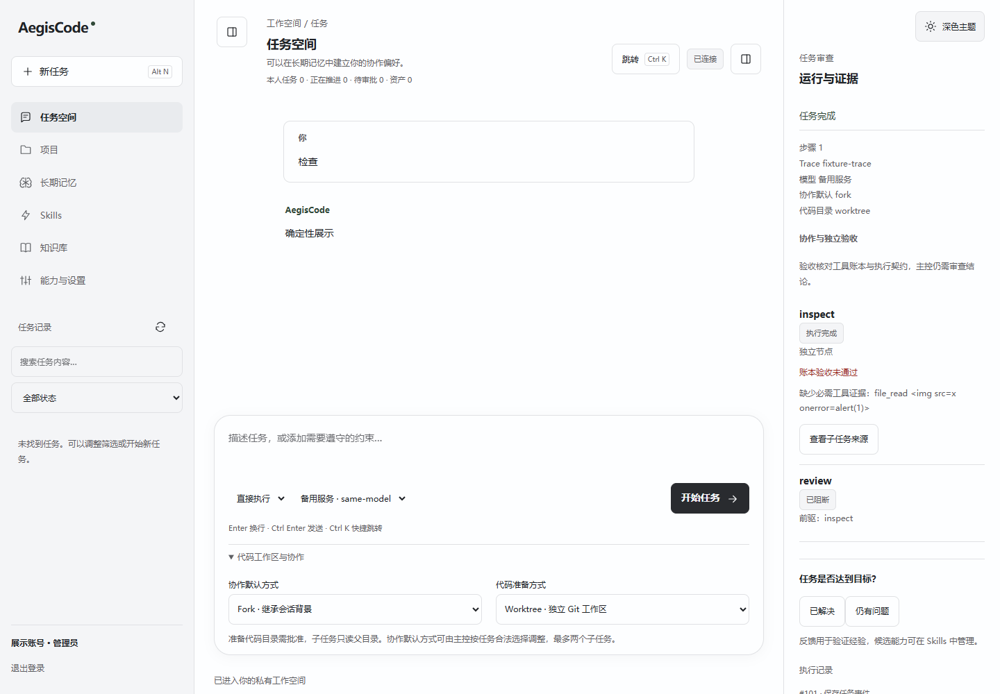
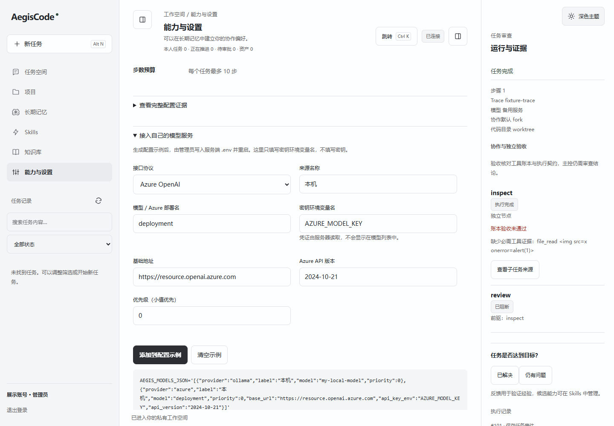

# AegisAgent · AegisCode

**把问答、代码任务、长期记忆与技能放在一个可审查的工作台。**

AegisCode 面向个人开发者和企业成员：描述目标，由 Agent 规划、调用工具并保留执行证据；需要写文件、运行代码或调用外部服务时，由用户批准。经过审阅的偏好、约束和任务经验可以跨会话复用。

快速开始：[下载 Windows 安装器](https://github.com/doinb666/AegisAgent/releases/download/v0.2.6/AegisCode-Setup.exe) · [下载便携版](https://github.com/doinb666/AegisAgent/releases/download/v0.2.6/AegisCode-portable.zip) · [全部安装方式](#安装与启动)。

[安装与启动](#安装与启动) · [使用场景与截图](#使用场景与截图) · [模型配置](#模型配置) · [使用方式](#使用方式) · [项目亮点](#项目亮点) · [使用手册](docs/使用手册.md)


## 界面与操作

暖灰导航、柔白会话区、浅绿记忆与选中状态、冷灰审查区，配合石墨深色主题。正式界面使用 **TypeScript + Vite、HTML/CSS**，随 FastAPI 和 EXE 提供静态页面。AegisCode 把个人长期记忆、Skill 审阅和工具证据保留在同一工作台。上图为当前源码界面，公开 **0.2.6 下载包尚未包含本次布局更新**。

- 顶部按钮折叠两侧面板，聚焦当前线程；窄屏默认收起导航。
- 侧栏「项目会话／任务历史」切换记录类型；项目树刷新保留展开状态，当前会话高亮。账号与退出入口固定在侧栏底部。
- 「记忆与空间概览」按需展开；输入区解释执行模式，项目标签与会话操作合并在输入区上方。
- `Ctrl K` / `Cmd K` 搜索入口，方向键选择、`Enter` 打开、`Esc` 关闭；`Alt N` 开新任务，`Ctrl Enter` 发送。
- 回答中的代码块独立展示并支持复制；任务文件只读预览，写文件与运行代码需审批。
- 当前源码支持同一会话的历史问答与分页加载；选中旧任务时只展示截至该任务的问答，子任务保留独立视图。
- 当前源码支持项目下多个独立会话、重命名、归档与恢复；新库直接使用，旧库先备份迁移，见[项目会话使用指南](docs/项目会话使用指南.md)。
- 顶部站内通知提供完成、失败与审批提醒；已读可跨重启保留，点击定位任务，见[通知使用指南](docs/站内通知使用指南.md)。
- 协作选项接通 Fork、Agent Team 与审批后的 Worktree/代码副本准备；主控保留控制权，子任务目前只读。

<details>
<summary>查看新版任务审查与深色界面</summary>


新版截图来自独立数据库、真实 HTTP 链路与确定性测试模型，用于展示交互，不代表真实模型效果。操作导览见[新版工作台指南](docs/新版工作台指南.md)。

</details>

界面借鉴编码助手的通用布局，保留 AegisCode 的记忆、技能和审查特色。当前尚无内嵌代码编辑器、差异审阅、自动 PR/合并及模型逐 Token 流，完整范围见 [界面与功能对照](docs/AegisCode界面与功能对照.md)。

## 使用场景与截图

| 你想完成的工作 | 操作入口 | 平台带来的价值 |
|---|---|---|
| 持续讨论代码问题 | 任务空间 → 打开任务 → 继续提问 | 历史问答可分页查看，保留任务状态与执行证据 |
| 同时推进一个项目的不同目标 | 侧栏「项目会话」→ 展开项目 → 新建项目会话 | 项目目标复用，线程上下文独立；可重命名、归档和恢复 |
| 跟进后台任务 | 顶部铃铛 → 站内通知 | 完成、失败与审批提醒可回看，已读状态持久保存 |
| 复用自己的工作方法 | 长期记忆、技能库 → 审核候选 → 启用 | 偏好、约束和成功／失败经验跨会话复用，技能可以修订或退役 |
| 分工处理复杂任务 | 输入区「代码工作区与协作」 | 主任务掌握规划与审批，最多两个只读子任务提供有界结果 |
| 核对任务是否真的执行 | 任务审查 → 协作与独立验收 | 检查完成状态和工具账本，缺少必要证据时阻断后续节点 |
| 使用自己的模型服务 | 能力与设置 → 接入自己的模型服务 | 支持兼容接口、Anthropic、Azure、Ollama 和自定义来源，独立熔断与降级 |
| 私有部署与日常使用 | EXE、源码／wheel、Docker | 同一套工作台覆盖个人本机与企业部署，资源按用户隔离 |

**连续问答与代码阅读。** 打开一个任务即可查看此前问答；较长会话点击「加载更早的问答」。0.2.6 源码与下载包均已提供。



**项目内多会话。** 同一项目分别讨论权限边界、性能和测试；各会话保留自己的问答与运行证据。下图来自独立数据库、真实 HTTP 链路和确定性测试模型；0.2.6 源码与下载包均已提供。



**及时跟进任务。** 顶部铃铛汇总自己的完成、失败和审批提醒，点击定位任务；审批需要用户单独决定。下图来自独立数据库与真实HTTP的确定性模型验收。



**可管理的技能。** 在 Skills 导入 SKILL.md、检查资源与适用边界，再启用；可以导出、修订、查看版本和退役，避免经验库只增不减。



**有证据的协作。** Fork 继承有界上下文，Team 保留独立会话；Worktree 准备需要审批。下图展示负例：子任务虽完成，但缺少要求的工具证据，验收不通过，后继节点被阻断。



**多来源模型配置。** 页面生成环境变量示例，管理员写入服务端配置并重启；页面填写密钥变量名，不填写密钥值。



更多操作见 [截图使用导览](docs/截图使用导览.md)，含深色、移动端、任务文件和精确审批。上述连续问答、协作与模型配置截图采用拦截业务请求的确定性夹具，Skill 截图来自独立测试账号；用于展示真实界面交互，不代表商业模型质量或线上业务效果。

## 安装与启动

| 方式 | 适用场景 | 需要准备 |
|---|---|---|
| Windows EXE / 安装器 | 日常桌面使用 | Windows；模型服务配置；发布状态见下文 |
| Python 源码 / wheel | 开发者、跨平台本地运行 | Python 3.12+ |
| Docker 个人版 | 简单部署和持久化 | Docker Compose；SQLite 数据卷 |
| Docker 企业版 | PostgreSQL 持久化部署 | Docker Compose；数据库密码；自己的 TLS 入口 |

已构建的工作台运行时不要求 Redis、Milvus 或 Node.js。使用模型需要可用的模型服务；执行代码需要单独配置 Docker 沙箱。只有修改 TypeScript 前端或自行构建发布包时需要 Node.js 20.19+ 或 22.12+ 与 npm。

### Windows 桌面使用

当前版本 **0.2.6**：[版本说明与全部下载](https://github.com/doinb666/AegisAgent/releases/tag/v0.2.6)。

- [Windows 安装器 EXE](https://github.com/doinb666/AegisAgent/releases/download/v0.2.6/AegisCode-Setup.exe)：安装到空目录后双击 AegisCode.exe。
- [Windows 便携 ZIP](https://github.com/doinb666/AegisAgent/releases/download/v0.2.6/AegisCode-portable.zip)：解压并保留完整目录。
- [Python wheel](https://github.com/doinb666/AegisAgent/releases/download/v0.2.6/aegiscode-0.2.6-py3-none-any.whl)：适合 Python 用户。
- [SHA256 校验和](https://github.com/doinb666/AegisAgent/releases/download/v0.2.6/SHA256SUMS.txt)：使用 PowerShell `Get-FileHash 文件名 -Algorithm SHA256` 核对。

如需自行构建，在 Windows 执行：

```powershell
git clone https://github.com/doinb666/AegisAgent.git
cd AegisAgent
npm ci
npm run frontend:verify
python -m venv .venv
.venv/Scripts/python.exe -m pip install ".[dev]"
.venv/Scripts/python.exe scripts/build_windows.py
```

构建后任选一种方式：

- 双击 `dist/AegisCode-Setup.exe`，按安装器提示安装。
- 解压 `dist/AegisCode-portable.zip`，双击其中的 `AegisCode.exe`。保留整个目录及 `_internal`。

EXE 默认仅监听本机，自动打开浏览器；配置与数据默认存放在 `%LOCALAPPDATA%/AegisCode/`。在该目录创建 `.env`，配置模型后重启。支持 `--port`、`--auto-port`、`--data-dir`、`--config`、`--no-browser` 和两项显式迁移入口。安装包不包含模型权重，当前构建未做代码签名。

EXE 桌面启动采用「本地服务 + 浏览器工作台」，Skills 与 Web 使用同一套功能和数据，不是原生 WebView 桌面壳。

### Python 源码启动

```bash
git clone https://github.com/doinb666/AegisAgent.git
cd AegisAgent
python -m venv .venv
```

Windows PowerShell：

```powershell
.venv/Scripts/python.exe -m pip install -r requirements-harness.txt
Copy-Item .env.example .env
# 填写自己的模型配置，见下文
.venv/Scripts/python.exe -m app.launcher
```

Linux / macOS：

```bash
source .venv/bin/activate
pip install -r requirements-harness.txt
cp .env.example .env
# 填写自己的模型配置，见下文
python -m app.launcher
```

浏览器访问 **http://127.0.0.1:8000**，先创建个人账号再登录。密码至少 8 个字符。8000 已占用时：

```powershell
.venv/Scripts/python.exe -m app.launcher --port 8001
```

当前源码还可添加 `--auto-port`：指定端口被占用时绑定空闲端口，并在日志显示实际地址。浏览器在本进程初始化完成后打开；初始化超过 60 秒会提示手动访问，不终止服务。0.2.6 下载包已包含这两项改进。

```powershell
.venv/Scripts/python.exe -m app.launcher --auto-port
```

wheel 构建与安装：

```bash
python -m pip install ".[dev]"
python scripts/build_wheel.py
# 安装 dist 中实际生成的 aegiscode-版本号-py3-none-any.whl
python -m pip install dist/aegiscode-0.2.6-py3-none-any.whl
aegiscode
```

### Docker 部署

先复制 `.env.example` 为 `.env` 并填写模型配置。

个人版使用 SQLite：

```bash
docker compose -f docker-compose.personal.yml up --build -d
```

企业版使用 PostgreSQL，先在 `.env` 设置自己的 `POSTGRES_PASSWORD`：

```bash
docker compose up --build -d
```

默认访问 http://127.0.0.1:8000，数据通过卷持久化。管理员在「能力与设置」创建企业成员，支持管理员、操作员和只读成员。远程部署通过自己的 TLS 入口访问；多副本部署还需配置共享限流、备份和沙箱隔离。

升级时备份配置与数据，更新源码后重新构建并启动。不要删除数据卷；现有任务出现 `interrupted` 时先核对工具副作用，避免重复执行。

### 旧数据库启用项目会话

先安排维护窗口并停止业务写入，运行预览，再指定**不存在的新备份文件**执行迁移，完成后重启服务：

```powershell
.venv/Scripts/python.exe -m app.harness.thread_migration --data-dir data
.venv/Scripts/python.exe -m app.harness.thread_migration --data-dir data --apply --backup backups/before-threads.sqlite
.venv/Scripts/python.exe -m app.launcher --data-dir data
```

0.2.6 安装包可用 `aegiscode --migrate-threads` 或 `AegisCode.exe --migrate-threads` 传入相同参数。PostgreSQL 先完成 `pg_dump`，再提供备份文件。通知表另用 `python -m app.harness.notification_migration` 预览／备份迁移，见[通知使用指南](docs/站内通知使用指南.md)。迁移保留旧任务与会话标识，重复执行不新增关联；详细 Docker 命令与恢复说明见[项目会话使用指南](docs/项目会话使用指南.md)。

## 模型配置

最小 `.env` 示例：

```dotenv
OPENAI_API_KEY=替换为自己的密钥
OPENAI_API_BASE=https://api.openai.com/v1
OPENAI_MODEL=替换为可用且支持工具调用的模型
AEGIS_DATA_DIR=data
```

源码支持 OpenAI 兼容／自定义网关、Anthropic 原生 Messages、Azure OpenAI 和本地 Ollama。最多配置 32 路来源，可按优先级和权重路由；同名模型的不同来源具有独立连接与熔断状态，失败时按候选顺序降级。具体字段与示例见 [多来源模型接入](docs/多来源模型接入.md)。密钥只放环境变量或本地 `.env`，不要提交到 Git。

未配置模型时仍可登录、管理记忆和资料；执行任务会明确提示失败。模型列表表示已配置，连通性需实际调用验证。

## 使用方式

1. **建立个人偏好**：在「长期记忆」保存回答风格、约束和边界，审阅后启用。再次登录会加载本人有效偏好，任务开始时按需召回相关经验。
2. **提供资料和项目背景**：在「知识库」上传 TXT、Markdown 或文本 PDF；在「项目」保存目标和约束，再创建任务。扫描 PDF 需先 OCR。
3. **执行任务**：描述目标与验收要求，选择直接执行或先规划。查看任务进度、完整工具证据和本人工作区文件；有副作用的操作逐次审批。
4. **复用与改进技能**：任务结束后反馈成功或失败，在「Skills」审查候选经验的来源、适用条件和边界，再启用、修订或退役。可导入导出 SKILL.md 及文本资源包。
5. **恢复长任务**：断开页面连接不会取消后台任务，重新打开后恢复持久事件。需要停止时使用「停止任务」；未知副作用状态需人工核对。

可以从以下任务开始：

```text
根据我的知识库回答问题，列出来源，并指出证据不足的部分。
审查代码中的空输入、异常处理和权限边界，先收集证据再给结论。
将本次失败原因整理成技能候选，写清触发条件、修复步骤和验证方法。
```

Skill 快速体验：[下载示例 SKILL.md](docs/examples/skills/review-python/SKILL.md)，在「Skills」导入并审阅启用。资源只作为文本读取，不会自动执行脚本。

### 多 Agent 和代码工作区

当前主 Agent 可通过工具委派最多两个只读子任务，统一汇总结果；子权限取父权限交集，禁止递归和危险操作，预算为主控汇总预留空间。

- **Fork**：继承有界会话上下文，适合从同一背景分头分析。
- **Agent Team**：独立上下文的受控子任务，由主 Agent 汇总证据。
- **Worktree / 代码副本**：经审批从管理员绑定仓库准备独立目录；Worktree 使用 detached 方式，不自动合并用户分支。

准备仓库后，子任务可在父权限交集内只读父工作区；主控可提交最多两个节点的小型依赖图，根节点并行、后继仅在前驱通过账本验收后执行。验收门检查真实终态、非空回答、父子链和必需工具证据，不接受回答中的“已完成”自报。当前仍不允许子任务写仓库、递归委派或自动合并。管理员配置和操作步骤见 [使用手册](docs/使用手册.md)。

## 项目亮点

- **受控任务闭环**：工具调用与持久任务结合，支持规划失败回退、默认 10 步预算、反思反馈和全链路 Trace ID。
- **个人长期记忆与技能积累**：成功与失败轨迹提炼为偏好、约束、经验和 Skill 草稿；来源追溯、去重、版本修订和退役形成跨会话复用闭环。候选经审阅后生效，权限规则不参与自进化。
- **分层上下文管理**：大工具结果外置保存，保留预览与读取引用；按完整工具调用消息组裁剪近期窗口，并记录历史计数与边界提示。缓存与 Token 收益以实测为准。
- **中心化多 Agent**：主控保留规划和审批权；子运行只读、有限预算、父权限子集，父停止后回收活跃子，长结果可按引用读取全文。
- **权限与安全边界**：租户与用户隔离、角色控制、工具参数校验、模型风险信号和精确参数人工审批；代码只在配置的 Docker 沙箱执行。
- **外部 MCP 与知识检索**：官方 MCP SDK 接入运维批准的服务；知识库使用 BM25，可选 Milvus 向量、RRF 融合和 Cross-Encoder 重排，依赖故障明确降级。
- **恢复与模型容错**：幂等任务创建、Worker 租约、检查点、取消、SSE 游标重连；多模型路由与三态熔断，60 秒恢复探测窗口。

自进化指推理时的记忆与技能积累，当前不会在线更新模型权重。上述机制不保证每次任务成功，未知副作用不会自动重放。

## 当前技术栈

| 层次 | 技术 |
|---|---|
| 后端与执行内核 | Python 3.12、FastAPI、异步任务执行、原生工具调用 |
| 存储 | SQLAlchemy async、SQLite（个人版）、PostgreSQL（企业版） |
| 模型与外部工具 | OpenAI 兼容／Anthropic／Azure／Ollama、自定义网关、MCP SDK、多模型路由与熔断 |
| 可选知识检索 | Milvus、BM25、RRF、Cross-Encoder |
| 工作台 | TypeScript、Vite、HTML/CSS、SSE、Playwright |
| 安装与隔离 | Docker Compose、Docker 执行沙箱、PyInstaller、Python wheel |

当前主链路采用自主 Harness；LangChain、LangGraph、Redis 不再是当前核心依赖。完整使用方法见 [用户手册](docs/使用手册.md)，安全部署见 [安装与运维](docs/升级方案/06-安装与运维.md)，能力验证与边界见 [验收记录](docs/升级方案/12-多Agent协作补齐与验收.md)。

## 常见问题

- **注册提示字段错误**：账号不能为空，密码至少 8 字符。界面会先校验并显示具体原因；浏览器缓存旧界面时请强制刷新。
- **没有模型或任务失败**：填写模型配置并重启，确认该模型支持工具调用和你的账号权限。
- **无法执行代码**：配置并验证 Docker 沙箱；未配置时拒绝执行，不降级为宿主运行。
- **看不到仓库工具或 MCP**：它们由运维配置与用户授权决定，不能通过普通对话添加任意宿主路径或服务地址。
- **下载或启动安装器**：使用上方 0.2.6 Release 链接并核对 SHA256；便携版不能只复制一个 EXE。默认 8000 已占用时，从安装目录执行 `./AegisCode.exe --port 8002`，选择一个空闲端口。

API 文档位于 `/docs`，数据库就绪探针为 `/api/v1/health/ready`。业务 API 需要登录令牌，创建任务需要 `Idempotency-Key`。

包元数据标记 MIT，仓库尚缺 LICENSE 正文；正式使用和分发前请核对权属及许可。
