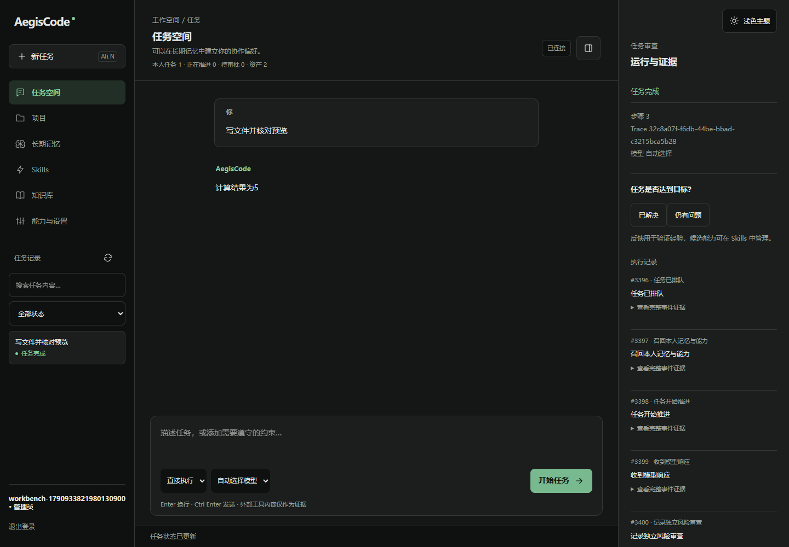

# AegisAgent · AegisCode

AegisCode 是基于 AegisAgent 升级的个人与企业问答、文档和代码任务工作台。通过 Query Loop、原生 Tool Calling 和持久化任务记录执行任务，将经过审阅的偏好、约束和经验跨会话复用。

当前是受控自进化 MVP：经验与技能在推理时积累，**不会在线训练或更新模型权重**。界面借鉴 Coding Agent 的任务工作方式，使用自主设计，不宣称复刻 Codex 或 Claude Code 源码。

## 当前能力

| 能力 | 当前实现 |
|---|---|
| 执行闭环 | ReAct / Plan，规划失败回退，默认10步预算，反思与质量反馈 |
| 用户与权限 | 登录、注销、租户与用户隔离；admin / operator / viewer；业务资源默认用户私有 |
| 持久任务 | SQLite个人版 / PostgreSQL企业版；幂等创建、Worker租约、检查点、取消、SSE游标重连 |
| 长期记忆 | 画像、偏好、约束、情景与程序经验；登录加载、按需召回、版本修订与退役 |
| 自进化 | 后台有界提炼成功/失败轨迹为草稿；用户审阅启用，修改后重新审核；保留来源 |
| Skill文件生态 | SKILL.md / JSON文件包导入导出、目录与描述路由、文本资源审核与渐进读取、修订版本冲突保护 |
| 上下文 | 大工具结果外置artifact，摘要与近期窗口、字符预算、按需读取；缓存收益尚未实测 |
| 多 Agent | 主Agent控制只读子任务，独立子槽、共享步数预算、取消传播；Fork/Team与受控仓库Worktree |
| 安全执行 | 规则过滤、工具参数校验、模型风险分类、精确参数人工审批；代码仅在配置的Docker沙箱运行 |
| 外部 MCP | 官方SDK接入运维配置的HTTP服务；工具允许列表、租户/用户绑定、超时与响应预算 |
| 知识问答 | TXT/Markdown/文本PDF解析、分块BM25；可选Milvus向量 + RRF + Cross-Encoder，失败明确降级 |
| 模型兜底 | 多个OpenAI兼容endpoint、优先级路由、独立三态熔断、60秒恢复探测 |
| 工作台与安装 | 深色/浅色中文桌面工作台、真实任务检索与游标分页、证据审查和只读文件预览；源码、wheel、Docker、Windows EXE与安装器构建 |

详细能力与证据：[现状核查](docs/升级方案/01-现状核查与调研.md)、[架构与验收](docs/升级方案/02-MVP架构与验收.md)、[MVP验收](docs/升级方案/04-验收与部署记录.md)、[0.2.1交付记录](docs/升级方案/08-0.2.1交付与同步记录.md)、[0.2.2源码能力与交付核验](docs/升级方案/11-0.2.2交付与源码能力核验.md)。



## 快速开始

要求 Python 3.12+。Docker、Milvus及模型服务按需配置，个人基础版不依赖Redis或Milvus。

```bash
git clone https://github.com/doinb666/AegisAgent.git
cd AegisAgent
python -m venv .venv
```

Windows PowerShell：

```powershell
.venv/Scripts/python.exe -m pip install -r requirements-harness.txt
Copy-Item .env.example .env
# 编辑 .env，填写自己的模型参数
.venv/Scripts/python.exe -m app.launcher
```

Linux / macOS：

```bash
source .venv/bin/activate
pip install -r requirements-harness.txt
cp .env.example .env
# 编辑 .env，填写自己的模型参数
python -m app.launcher
```

浏览器打开 `http://127.0.0.1:8000`，先创建账号再登录。启动器默认仅监听本机。未配置可用模型时任务会明确失败；账号、资产和工作台仍可使用。

最小 `.env` 配置：

```dotenv
OPENAI_API_KEY=替换为自己的密钥
OPENAI_API_BASE=https://api.openai.com/v1
OPENAI_MODEL=替换为实际可用且支持工具调用的模型
AEGIS_DATA_DIR=data
```

不要提交 `.env`。EXE 默认从 `%LOCALAPPDATA%/AegisCode/` 读取 `.env` 并保存数据；可用 `--config` 指定配置目录。源码、wheel和EXE均支持 `--port`、`--data-dir`、`--no-browser`。

## 如何使用

1. 在「长期记忆」记录协作偏好、硬约束和边界，审阅后点击「启用」。再次登录自动加载本人有效记忆。
2. 在「知识库」上传资料；扫描PDF须先OCR。在「项目」保存目标与约束，再从项目创建任务。
3. 在任务空间描述目标与验收标准，选择执行策略及模型，查看状态和事件。写文件、外部MCP和代码执行会显示准确工具参数供审批。
4. 完成后反馈成功或失败；在「Skills」检查候选来源与适用边界，再决定启用、修订或退役。候选不自动成为可信能力。
5. 网络断开时任务由后台继续处理；页面恢复事件，不重复创建任务。`interrupted` 表示副作用结果未知，应先核对外部状态。

左侧搜索任务并筛选状态，每页20项；右侧可展开完整事件证据、只读预览本人任务文件。主题切换保存在当前浏览器，折叠审查区可扩大中央线程。顶部统计来自本人数据库记录，没有模拟业务指标。

完整操作、权限和恢复说明见 [用户使用手册](docs/使用手册.md)。

Skill 文件快速体验：下载 [review-python 示例](docs/examples/skills/review-python/SKILL.md)，在「Skills」导入，检查后启用。可按目录筛选，导出 SKILL.md 或包含文本资源的 JSON 文件包；导入资源不会作为脚本运行。

## Docker 与 Windows 安装

个人版（SQLite）：

```bash
docker compose -f docker-compose.personal.yml up --build -d
```

企业版：自行设置 `.env` 中的 `POSTGRES_PASSWORD`，再运行：

```bash
docker compose up --build -d
```

两种方式默认发布本机8000端口并持久化数据卷。需要远程访问时，在自己的TLS入口后部署，生产多副本增加共享限流和备份。企业成员由管理员在「能力与设置」创建；admin不隐式读取其他用户的资产。

Windows构建：

```powershell
.venv/Scripts/python.exe -m pip install ".[dev]"
.venv/Scripts/python.exe scripts/build_windows.py
```

输出 `dist/AegisCode-Setup.exe`、`dist/AegisCode-portable.zip` 与 `dist/AegisCode/AegisCode.exe`；便携版须保留整个目录及 `_internal`。这些是本地构建产物，仓库不内置二进制，也尚未发布签名Release。wheel使用 `python scripts/build_wheel.py` 在临时源码副本构建并校验，避免历史构建缓存带入已删除模块；安装后执行 `aegiscode`。

沙箱、MCP、模型兜底、可选RAG及运维配置见 [安装与运维](docs/升级方案/06-安装与运维.md)。无沙箱时拒绝代码执行，不改用宿主执行。

## 技术栈与结构

主入口：Python 3.12、FastAPI、SQLAlchemy async、SQLite/PostgreSQL、OpenAI兼容工具调用、MCP SDK、Docker、静态HTML/CSS/JavaScript、PyInstaller。

旧Agent编排、Redis记忆/缓存、工具注册/路由与独立RAG生成链已移除；工作台执行与记忆由 `app/harness/` 承担。Milvus、Reranker、计算工具、模型路由/熔断及ETL仍有实际消费者。完整运行与可选演示依赖在 `requirements.txt`，基础工作台依赖在 `requirements-harness.txt`，重型检索按需安装 `pip install ".[rag]"`；`legacy` extra保留名称，仅安装Gradio演示依赖。

旧无鉴权 `/chat` 和文档路由源码暂时保留，但不在主入口挂载；新增Gradio独立演示仍引用旧HTTP路径，其与当前后端的兼容性**未验证**。删除依据、保留边界与回归结果见 [全目录冗余清理记录](docs/升级方案/10-全目录冗余清理记录.md)。

```text
app/harness/        身份、任务事实源、执行闭环、上下文与经验资产
app/harness_tools/  工作区、沙箱、MCP、仓库与知识检索
app/api/           鉴权API、SSE与请求边界
app/web/           AegisCode工作台
app/etl/           有资源预算的独立文档解析进程
app/core/          复用的意图识别、计算工具与可选重排
app/infrastructure/ 模型路由、向量库及保留的旧追踪/数据库组件
scripts/           安装、打包、浏览器与专项验收
tests/             权限、恢复、工具、API及并发回归
docs/              使用说明、设计决策与验收证据
```

API文档：`/docs`；基础健康探针：`/api/v1/health`；数据库readiness：`/api/v1/health/ready`。业务接口均需要Bearer令牌，创建任务还须 `Idempotency-Key`。身份、任务、资产和审批示例见使用手册。

## 验证与限制

2026-10-02后端回归：175项通过、1项因Windows符号链接权限跳过。工作台新增主题、分页、文件预览、乱序请求、XSS、viewer权限和390/768/1440屏宽的真实Edge验收通过；旧业务与Skill浏览器流程继续通过。0.2.2默认Dockerfile构建、依赖兼容、非root运行和API专项验证通过。历史真实PostgreSQL双实例与10/50/100并发、官方MCP SDK、本地HTTP服务和Docker隔离证据见验收记录；压测模型为确定性替身，不能代表商业模型延迟或效果。

尚未实现在线RL/LoRA、自动安装/执行生成工具、企业共享技能发布、独立技能回放晋升与训练平台。真实模型、Prompt Cache收益、真实Milvus/重排质量、干净Windows安装及Linux沙箱Compose组合仍需专项验收。安全分类与反思可能出错，不能代替权限规则和人工审阅。

原文案的Top-5提升15%、缓存小于50ms、Token降低40%缺少可复核记录，均为**未验证**，不作为本项目成果。外部论文结论同样不能作为本项目指标。

开发回归：

```bash
pip install ".[dev]"
python -m pytest tests -q
```

后续路线见 [实施进度](docs/升级方案/03-实施任务与进度.md) 和 [Skill文件生态计划](docs/升级方案/07-Skill文件生态与迭代计划.md)。

## 许可

包元数据标记为 MIT；当前仓库缺少 LICENSE 正文，正式发布前需由维护者核对权属并补齐许可文件。
