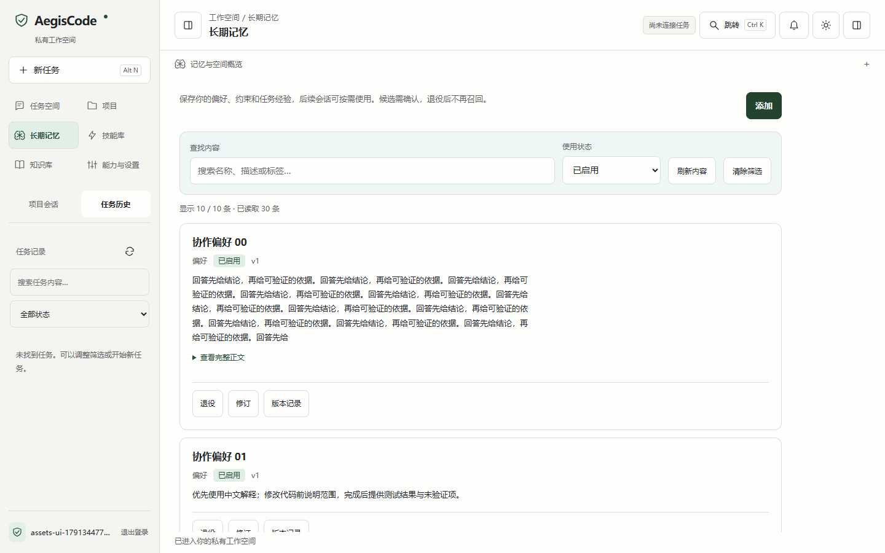
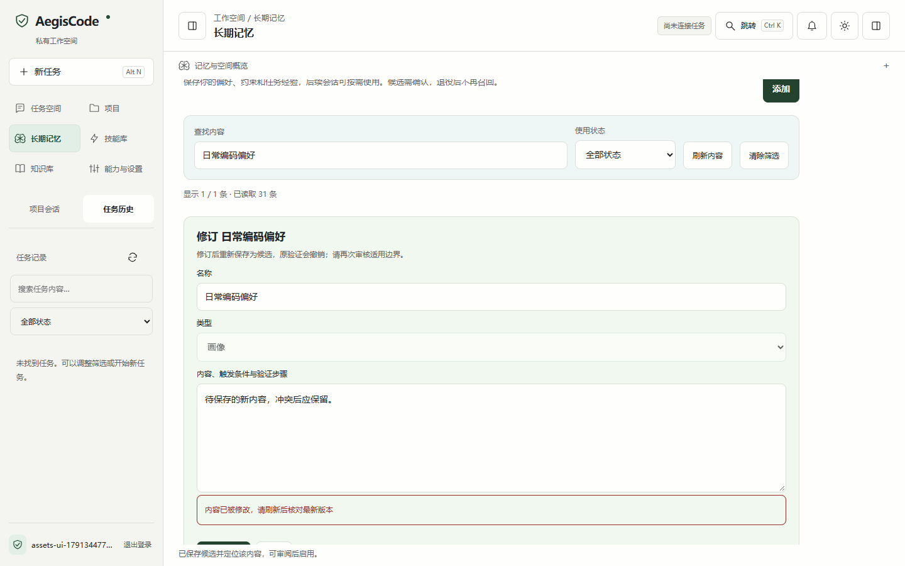
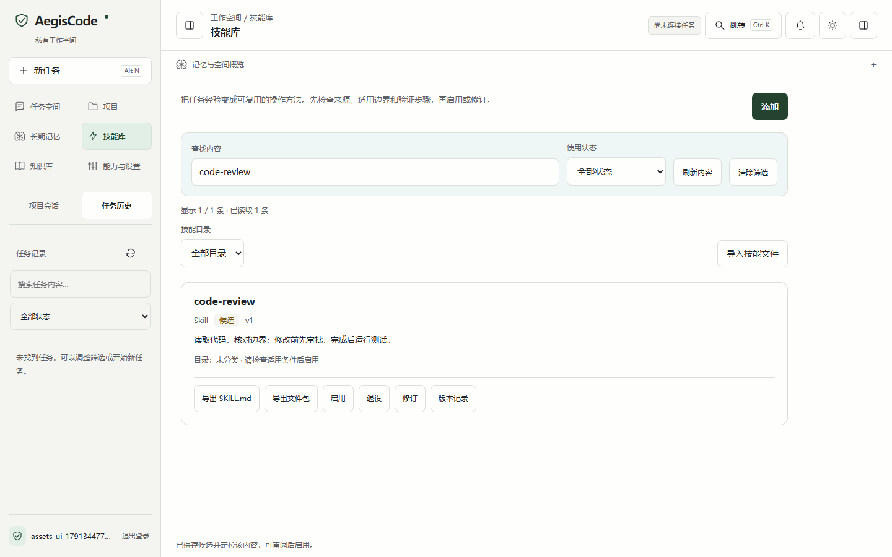
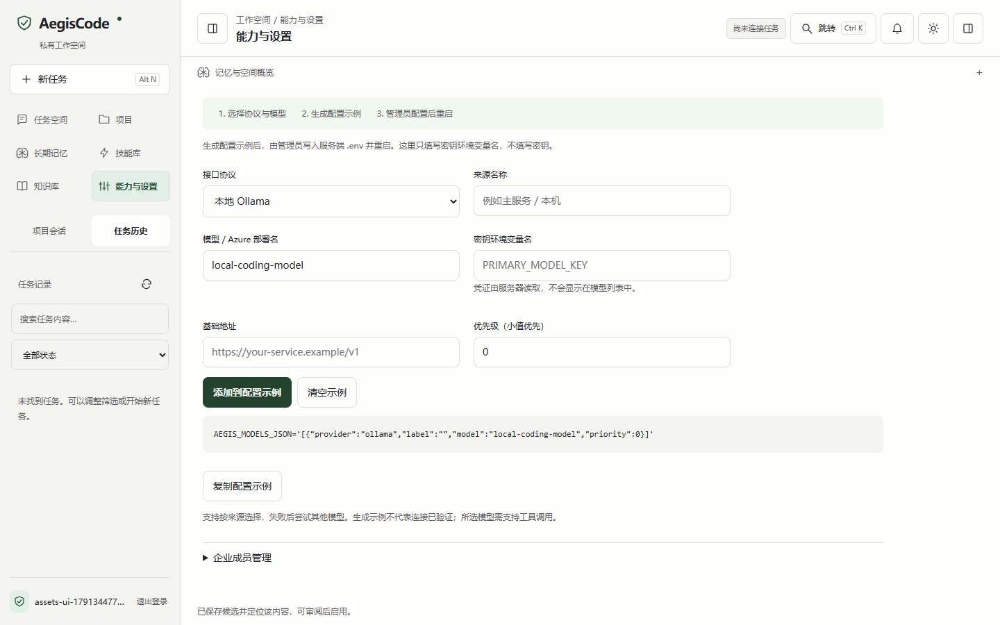

# 记忆、技能与模型接入指南

内容管理沿用工作台的浅色层次和深色主题，区分「查找内容」「查看正文」「审阅后启用」三步。本人长期记忆、技能、项目和知识库分别管理，其他用户的私有内容不会加入列表。

## 查找与阅读

进入左侧「长期记忆」「技能库」「项目」或「知识库」。顶部可搜索名称、描述、标签和逻辑目录，并按候选、已启用或已退役筛选。技能的目录筛选可以与关键词和状态同时使用；没有匹配内容时调整条件或清除筛选。

列表先展示 24 条，点击「显示更多」继续展示下一批。计数说明当前显示数量、筛选匹配数量和已读取数量。正文先显示最多 180 个字符，点击「查看完整正文」再展开；不会执行正文中的 HTML 或脚本。

目前服务端一次最多返回 500 条本人资产，以上筛选只作用于已返回内容。它不是全库分页搜索；如果总资产超过读取上限，当前页面可能找不到未返回的资产。分批展示减少初始页面节点，不减少接口已经返回的正文数据。

## 添加、修订与审核

点击「添加」，填写名称、类型和正文。类型随当前页面限制：记忆页管理偏好、约束及经验，技能页管理技能与操作流程，项目页管理项目背景。名称和正文不能只包含空白。

保存后默认是候选，列表自动用名称定位保存内容。检查来源、适用条件和边界后再启用；退役内容不再召回。修订时保留原类型、资源和元数据，提交读取时的版本；修订后的候选需要重新审核。

失败提示出现在表单附近并获得焦点，保留未提交内容。版本冲突时先复制自己的修改，再关闭编辑器、刷新并打开最新版本合并；不要直接反复提交旧版本。列表读取失败时点击「重新读取」，不会重复创建内容。

技能支持导入、导出、资源检查、版本记录及退役；详细边界见[使用手册](使用手册.md#skill-文件交换与渐进读取)。失败经验提炼出的候选不会自动获得权限，也不会未经审核直接执行。

## 上传资料

在「知识库」选择 TXT、Markdown 或文本 PDF 上传。扫描 PDF 没有可提取文本时，需要先 OCR；422 等错误直接显示在上传表单附近。上传文件仍受服务端格式、大小、解析与权限规则约束。

## 接入模型服务

打开「能力与设置」中的模型配置区域：

1. 选择来源协议，填写模型标识、地址和密钥环境变量名。本地 Ollama 按其配置要求填写。
2. 添加来源，生成 `AEGIS_MODELS_JSON` 示例；可配置多路候选。
3. 点击「复制配置」，由管理员写入服务端 `.env`，补齐对应密钥后重启并实际验证工具调用。

页面不接收密钥值，也不直接修改服务端配置。剪贴板不可用时会选中文本并提示手动复制。清空只清除当前页面示例，不修改已部署来源；尚未结束的复制响应不能恢复已清空状态。

截图来自独立临时数据库与测试账号；故障提示含确定性故障注入，用于说明交互，不代表商业模型效果。更多协议字段见[多来源模型接入](多来源模型接入.md)。
