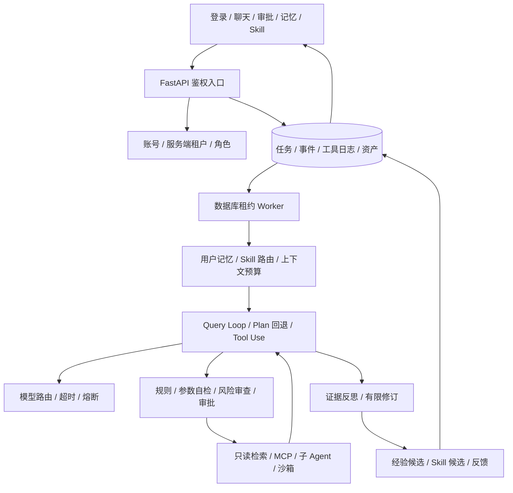

# AegisAgent Harness MVP 架构与验收

目标：在现有代码上建立可登录、可隔离、可恢复、可审查的问答 / Coding Agent；执行经验可转为有证据和生命周期的记忆与 Skill。用户已授权先文档自检再实施，Git 提交仍需另行确认。

## 1. 交付边界

MVP 是可运行的机制闭环；“企业生产可用”另需真实 PG/Redis/Milvus/MCP/容器/多模型联测及负载评测。不得用测试替身代替外部验收。越用越聪明是待验证目标，不是无条件保证。

首版实现不改权重的自进化；在线 RL/LoRA 为明确独立的后续训练系统。个人版可使用 SQLite 与原生浏览器工作台、EXE 启动；企业版选择 PG 持久化、Docker 沙箱与配额。任何不能在当前机器实测的交付必须在验收台账保持未验证。

## 2. 技术栈决策

| 层 | 首版选择 | 原因 |
|---|---|---|
| API / 执行 | Python 3.12、FastAPI、asyncio、Pydantic | 复用现有工程；工具、模型 I/O 异步，CPU 分块线程化 |
| 状态 | SQLAlchemy 2 async；个人 SQLite/aiosqlite，企业 PostgreSQL/asyncpg | 任务队列、租约、幂等、审批、资产为同一事实源 |
| 模型 | OpenAI 兼容工具调用协议、多 endpoint 配置 | 支持 OpenAI/兼容网关/本地兼容模型；原生 Anthropic 协议需单独适配，不能冒称通用兼容 |
| 召回 | 作用域过滤 + BM25；可选 Milvus 与重排 | 无向量依赖时可用；语义召回启用时必须携带 tenant/owner 条件 |
| 上下文 | 稳定系统前缀 + 外置结果 + 摘要/近期窗口 | 避免每轮完整工具输出；Prompt Cache 收益由 provider usage 实测 |
| MCP | 官方 Python MCP Client SDK，Streamable HTTP | 保留协议初始化、tools/list、tools/call；只允许管理员配置的 endpoint |
| 沙箱 | 独立执行边界，Docker 非 root、无网络、只读根、cap_drop、配额 | 不允许 API 容器直接成为执行沙箱；进程/Worktree 不能代替沙箱 |
| UI | FastAPI 同源静态 HTML/CSS/JS 工作台 | 个人 EXE 无需 Node/额外前端服务，适合初版发布；后续可替换 React |
| 分发 | Docker、源码 CLI、PyInstaller EXE、Windows 安装向导脚本 | EXE 提供个人服务；沙箱功能仍依赖隔离执行后端 |
| 测试 | pytest、pytest-asyncio、httpx、ruff；浏览器操作验收 | 安全、状态竞争、任务恢复与生命周期属于必须覆盖的高风险逻辑 |

## 3. 数据流与模块边界

`app/harness/`：身份、状态存储、生命周期、执行内核、记忆/Skill/上下文；`app/harness_tools/`：具体工具和隔离适配；`app/api/routes/harness.py`：HTTP 边界；`app/web/`：同源 UI；`scripts/`：安装、构建、评测；`docs/升级方案/`：计划与验收。

运行上下文固定为 `tenant_id + user_id + role + session_id + run_id`；tenant/user 从令牌对应的服务端账号得出，禁止接受请求体覆盖。所有查询、缓存、向量过滤、文件路径、事件和子 Agent 继承此边界。

## 4. 安全和隔离

- 每次公开注册创建独立个人租户；企业管理员在自己租户创建成员。禁止注册者提交任意 tenant_id 加入企业。
- 角色 admin/operator/viewer；viewer 读取自己资源，不能执行有副作用工具；管理员也不能读取其他租户。
- 用户资产默认私有；共享发布是明确操作，跨用户总结默认禁止。
- 账号密码加盐 PBKDF2，访问令牌使用随机不透明值、数据库只存 SHA-256，设置过期/注销；TLS 由生产入口提供。
- 外部资料、记忆与 Skill 标为不可信数据；工具名称和参数在服务端验证。敏感词检测/AI 分类仅为风险信号，不能替代强制权限。
- 写文件、shell、外部 MCP 调用先审批；审批绑定 run/tool/canonical_args_hash，不允许改变参数后复用批准。
- 不启用任意宿主 shell，不允许任意 SQL；上传按随机标识储存，限制类型、大小、路径与解析输出。
- Docker API 不挂到公网 API 容器；执行器单独运行或仅个人本地启用。企业强隔离可换 rootless/gVisor/VM 后端，Docker 容器不是抵抗一切内核攻击的保证。
- MCP 仅调用运维 allowlist，密钥来自环境变量；禁 endpoint 重定向，不把用户文本当 URL；逐个 host/tool 授权，输出限额和超时。

## 5. 执行、幂等与断点

状态：queued → running → waiting_approval / completed / failed / cancelled / interrupted。待审批重新入队时恢复原 run 的消息/步数，而非创建新任务。

- `tenant,user,idempotency_key` 唯一；相同键相同请求返回同一 run，不同请求返回 409；不要承诺模型执行 exactly-once。
- Worker 通过条件 UPDATE 竞争租约；心跳续约；有最大并发、用户活动任务上限、总步数和总时间预算。
- 每次工具调用先持久化 started，再执行，最后写结果；completed 日志可重用。崩溃落在副作用已发生、完成日志未写之间时标为 interrupted，人工核对，禁止自动重复危险调用。
- 任务事件持久化递增游标；SSE 支持 after / Last-Event-ID，断网重连只重放事件，不能重新生成答案；断连不取消任务。
- 取消需在模型/工具超时和步骤边界被检查；停机先停止领任务再取消后台任务。取消未知副作用也保留 interrupted 审计语义。
- 模型首选失败仍尝试其他已配置路由；熔断按 endpoint + model 区分并保留到服务关闭；60 秒是重新探测窗口。
- 无模型配置返回清晰失败；无向量服务使用受限词法检索；无安全沙箱拒绝执行，不能退回宿主进程。

## 6. 自进化、记忆和 Skill

资产类型：profile（偏好）、constraint（用户约束）、episodic（情景经验）、procedure（步骤）、skill（组合能力）、document（知识块）、artifact（原始工具结果）。均携带来源 run、证据、状态、版本与作用域。

登录后先返回 active profile/constraint 和能力目录；每次任务再按意图召回相关情景与 Skill。只加载元信息和少量匹配正文，禁止全库注入。

Skill 两阶段：作用域/状态/工具权限过滤 + 元信息词法候选，随后按标签、示例、适用边界、成功反馈精排。首版有限候选的确定性排序可替换为语义召回/Cross-Encoder；不要把词法排序称为语义精排。

失败经验必须包含“失败证据、触发条件、错误步骤、已验证修复或待验证状态”。任务自动产生 draft；用户反馈或独立验收后才激活。未验证修复不得成为自动执行指令。成功经验也需要验证条件。资产修订创建版本，可退役/恢复旧版本；保留使用和反馈事件。系统规则、权限与密钥不纳入可自进化区域。

上下文分层：大工具结果持久化为 artifact，注入摘要预览与 ID；需要原文时按范围读回。旧对话保留结构化目标、结论、待办与引用，近期对话保留原文；预算不足做兜底裁剪。稳定系统前缀在前，动态记忆在后。Token 使用和压缩比例必须来自记录，不能沿用 40%。

多 Agent：主 Agent 调用 delegation 工具，子 Agent 权限是父权限子集，深度和数量受限，返回简短结果及 artifact 引用，不移交身份或控制权。Fork 复制只读上下文；Worktree 只处理受控仓库，不执行任意用户给出的宿主路径；Agent Team 由主 Agent 汇总并行子任务，不开放 agent-to-agent 任意调用。

## 7. UI 方案

场景：用户在白天办公环境持续处理问答、代码和审批，使用浅色低刺激工作台。左侧会话/任务，中央对话，右侧能力与审批；桌面三栏、窄屏折叠；中文字体本地优先。组件包括登录/注册、任务状态与恢复、输入区、审批详情、长期记忆、Skill 版本、文档、模型状态。

空状态说明下一步；运行中显示步骤与可取消；等待审批显示确切工具参数；失败说明原因和恢复方式；重连保持已接收内容；权限禁止明确禁用；用户内容使用 textContent，禁止直接注入 HTML；令牌只存内存/会话存储并可注销；44px 触控与可见 focus，尊重 reduced-motion。

## 8. 验收矩阵

| ID | 输入与操作 | 应得到的输出 / 通过标准 |
|---|---|---|
| A01 | 未登录访问任务、文档、记忆 | 401，无业务数据 |
| A02 | A/B 租户或同租户不同用户互查 ID | 404/403，列表、事件、artifact 都不泄漏 |
| A03 | 同键并发创建 20 次、不同内容复用键 | 仅 1 个 run；不同内容 409 |
| A04 | 双 Worker 竞争同 run | 仅一方领到；租约过期恢复有确定语义 |
| A05 | 工具需审批，批准后重复批准 | 副作用批准前为 0，批准后仅 1 次；不同参数不可复用 |
| A06 | 工具执行后、落结果前模拟崩溃 | interrupted，禁止自动重复未知副作用 |
| A07 | SSE 断开、以游标重连 | 不丢持久事件、不重复执行；前端去重 |
| A08 | 无 API key、首选模型超时/限流 | 明确失败 / 切备用，不返回伪造成功 |
| A09 | 超步数、超时、取消 | 有界停止并记录原因，任务状态一致 |
| A10 | 提交偏好并激活，注销后登录新会话 | 自动出现同用户长期记忆；他人不可见 |
| A11 | 失败轨迹与成功反馈、重复沉淀 | draft 经验/Skill，有证据；去重；激活、修订、退役与恢复可追溯 |
| A12 | 长工具输出与超长会话 | artifact 可受权读回，输入预算受限，工具调用配对不被破坏 |
| A13 | 私有知识上传、查询、重启 | 文档持久化、仅本人可召回；向量不可用明确降级 |
| A14 | MCP tools/list/call 与恶意 endpoint | SDK 协议正确；非 allowlist 拒绝，外部调用审批，超时可恢复 |
| A15 | 沙箱读取宿主文件、访问网络、超时 | 无宿主挂载/无网络/有配额；无后端时拒绝，无宿主降级 |
| A16 | 子 Agent 越权、递归、并行 | 权限不扩大、预算受限、父链可查、主控汇总 |
| A17 | Docker / 源码 / EXE / 安装器 | 能启动 UI、登录、创建任务并持久化；冷启动、卸载不删除用户数据 |
| A18 | 目标并发负载、依赖故障 | 压测记录 p50/p95/p99、错误率、队列等待、取消延迟；未实测不标通过 |

## 9. 文档自检结论

已把商业 API 的推理时进化与在线训练分开；把个人本地启动与企业沙箱分开；没有把 Worktree 当安全隔离；没有承诺 exactly-once、绝对防注入、一定变聪明或外部研究数字迁移；每项能力都有验证输入输出。优先验证 A01–A12，再真实联测 A13–A18；未通过项保留到验收报告，不写为完成。
