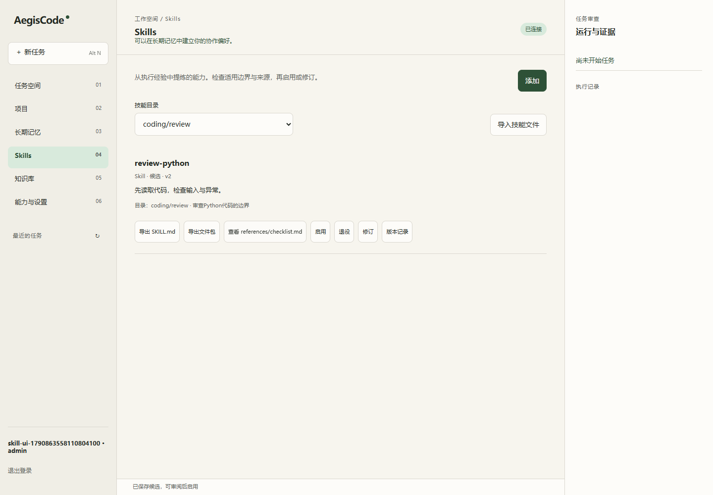

# AegisCode 0.2.1 交付与同步记录

日期：2026-10-01。范围：Skill文件生态、工作台交互与使用说明。承接[首批MVP验收](04-验收与部署记录.md)，不将首批安装包哈希用于本轮产物。

## 变更与能力边界

本轮补齐SKILL.md与JSON文件包的导入导出、目录与描述路由、文本资源审核和skill_read按需读取。导入强制草稿，更新已有技能要求expected_version，冲突返回409。普通修订保留目录与资源；撤销旧验证，来源与工具依赖不可伪造清除。

写入、导出与召回复用有界校验：拒绝YAML锚/别名/重复键、不支持标签、路径跳转、非法工具列表、不可序列化与非有限JSON；资源正文不进入召回预览。前端跨账号切换后丢弃旧文件读取与响应，退出时清空私有视图。

资源只保存为文本，不执行生成脚本、不自动安装工具与依赖。当前没有在线RL/LoRA、企业共享技能发布或独立回放晋升；未验证商业模型的任务成功率、缓存收益与真实Milvus/重排质量。

## 最终代码证据

| 检查 | 结果与范围 |
|---|---|
| `.venv/Scripts/python.exe -m pytest tests -q` | 166通过、1跳过，175.07秒；跳过为Windows符号链接权限 |
| Skill专项 | 75通过；覆盖解析、元数据预算、权限、CAS、资源与异常旧记录 |
| 规格与独立质量审查 | 通过，发现的修订丢资源/CAS及元数据边界问题已修复 |
| Ruff | 本轮Harness/API/工具/脚本/测试范围通过；不声称legacy全仓无lint问题 |
| compileall、node语法、git diff --check | 通过 |
| 构建 | 最终源码wheel、EXE、便携ZIP与安装器成功；Docker构建进行中 |

## 安装入口联测

浏览器验收使用真实Edge与本机隔离账号，不连接真实模型。覆盖恶意YAML拒绝、JSON导入、纯文本资源/XSS、双下载、修订保留目录与资源、重登录、390px窄屏及跨账号异步竞态；源码8772、独立wheel8773、安装后EXE8774均通过，页面错误为零。

独立wheel安装于`data/wheel-skill-acceptance/.venv`，已核对app来自该环境site-packages。Windows安装器安装至本机中文空目录`data/安装器Skill验收20261001`，数据与配置隔离在`data/skill-exe-data`；已分别重启wheel和EXE，启用状态、目录与文本资源仍可读取。未等同于干净Windows机器验收。

Docker本轮构建与联测结果待补。首次构建在依赖包下载阶段长时间无进度，已中断本轮构建并重试；没有停止已有企业容器或删除数据卷。已从运行容器验证PyPI索引和对应官方包下载HTTP 200，属于下载侧问题，不作为代码测试通过的证据。原任务审批、反馈、记忆、项目与上传浏览器集成此前在本轮通过，历史PG/MCP/沙箱与并发证据见04。

复核命令：

```powershell
.venv/Scripts/python.exe scripts/skill_browser_acceptance.py --url http://127.0.0.1:8772
.venv/Scripts/python.exe scripts/skill_restart_acceptance.py --url http://127.0.0.1:8773 --account <独立验收账号> --prepare
# 重启同一数据目录的服务后，去掉 --prepare 再执行
```



## 本地安装产物SHA-256

下列产物已从最终源码构建，Windows产物已在本机运行，未签名、未发布GitHub Release。wheel包含更新后的README；代码与静态页面与已联测版本一致。

| 文件 | SHA-256 |
|---|---|
| `dist/AegisCode-Setup.exe` | `46914BECEB663D343E2E1F12AB29EEE6BCDA3D9FB6D4E95CE756FB5A91604F2D` |
| `dist/AegisCode-portable.zip` | `ABA9F54225CD07D1372FF0176BC914CC454279F3B4C7EA1CF318CCB3147CB2FC` |
| `dist/AegisCode/AegisCode.exe` | `73C0769DFD4DC4E669E09B706C08C08C355899FEFEAD9B924DC7408AC6502A80` |
| `dist/aegiscode-0.2.1-py3-none-any.whl` | `ECD23D4522392688C0F46A078DEF97DE1B99A93EA0D439E833FBCCA6271CF185` |

便携包必须保留完整目录及_internal；二进制不提交到源码仓库。

## Git同步状态

用户已授权提交与普通推送，目标为`doinb666/AegisAgent`的main。首批本地提交：0ddbe56（Harness）、9689b24（工作台与分发）、42aab2f（使用文档）。本轮0.2.1已提交107fa56（Skill内核与测试）、974a824（工作台与验收脚本），文档随后单独提交；不混入用户已有Gradio及其他未关联改动。

前次推送被GitHub以用户名或Token无效拒绝。本轮重试前已fetch并确认远端main是本地HEAD祖先，普通推送成功：`f9273d2..974a824 HEAD -> main`。0.2.1内核与工作台已同步，本文档随后推送；没有force，没有在聊天接收Token。

以后遇到凭据失效时，可在本机重新登录：

```powershell
& 'C:/Program Files/Git/cmd/git.exe' credential-manager github login --username doinb666 --browser --force
```

工具调用简报：本轮使用本地Git/PowerShell、pytest/Ruff、Edge浏览器验收、PyInstaller/build与Docker；指定Sequential Thinking、DuckDuckGo、Context7、Serena工具未加载，未调用且未上传敏感信息。
