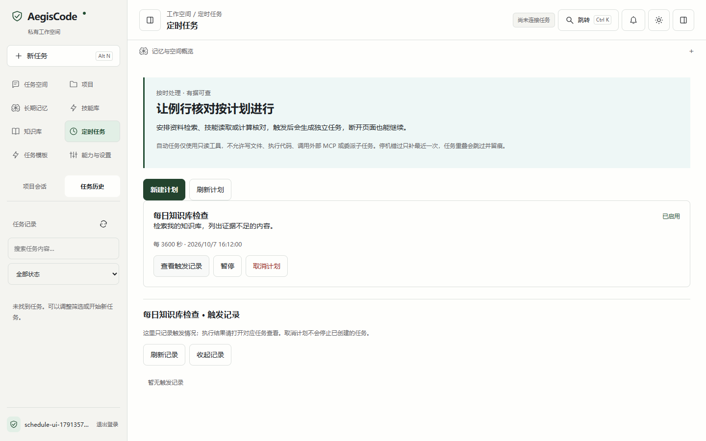
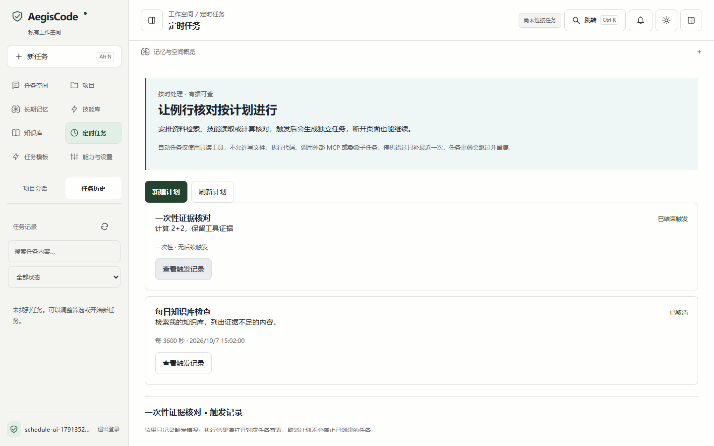

# 定时任务使用指南

源码和公开0.2.8安装包均提供定时只读任务。升级须安装完整新包并按下文备份迁移，不能仅替换旧EXE旁边的静态文件。

## 安排任务

登录后进入「定时任务」，点击「新建计划」，填写名称、任务内容、首次触发的本地时间，选择仅一次或固定间隔。间隔单位为秒，范围60至2678400秒。页面转为带时区的UTC时间发送，服务端持久化。

适合的任务：定期检索自己的知识库、查阅已启用技能、读取本人任务产物、核对计算。自动任务仅允许calculator、knowledge_search、skill_read、artifact_read，且与触发时的用户权限取交集；没有文件读写、外部MCP、代码执行和子Agent权限。提示文字、Skill或模型不能扩充此白名单。

计划不要求页面保持打开，服务端需持续运行。任务仍受运行配额、模型熔断和执行步数上限约束。管理员或操作员可创建及管理本人计划，只读成员仅查看自己的记录。

## 暂停、取消与记录

- 暂停：阻止后续创建运行，恢复后继续；版本冲突时刷新再操作。
- 取消：计划不可恢复。如需重新安排，创建新计划。
- 已结束触发：一次性计划已结束调度，不表示对应执行任务成功。
- 取消或暂停不会终止已创建的任务；打开执行任务后使用停止按钮。
- 查看触发记录：显示最近20条记录、跳过原因与执行任务入口。详情展开时每3秒刷新；切页、隐藏页面或退出后停止轮询。
- 停机错过：固定间隔只补最近一个时间点，不生成全部历史积压任务。
- 上一轮仍在执行：跳过新的触发并留痕；达到用户活动配额会有限退避重试。

页面创建失败保留输入；相同内容重试复用幂等键。即使服务端已提交而客户端丢失响应，也会找回同一计划。修改内容后使用新键。





截图来自独立数据库、真实HTTP与确定性测试模型，不代表商业模型效果。

## 旧数据库升级

新数据目录首次初始化自动创建计划表。已有任务数据库不会静默升级：先停止使用同一数据库的服务，默认预览，再显式备份迁移，最后重启。

```powershell
# 默认只预览，不改数据库；路径替换为自己的数据目录
.venv/Scripts/python.exe -m app.launcher --migrate-schedules --data-dir data
# 必须指定备份；SQLite路径须为未使用的新文件，程序会先创建备份
.venv/Scripts/python.exe -m app.launcher --migrate-schedules --data-dir data --apply --backup data/backups/before-schedules.sqlite3
```

使用自定义环境配置时附加`--config 配置目录`。PostgreSQL需事先完成pg_dump并以`--backup`提供备份证明文件；本轮新增PostgreSQL迁移及双实例专项尚未实测。迁移只追加表，不删除旧任务、资产或会话。迁移失败检查备份、数据库连接及文件权限；禁止删除数据库来“修复”。

接口：`POST /api/v1/schedules`需要`Idempotency-Key`；列表`GET /api/v1/schedules?limit=20`，最大50、私有before游标；详情`GET /api/v1/schedules/{id}`；状态变更`PATCH`携带`action`及`expected_version`。时间要求带时区的ISO8601，禁止额外路径或工具字段。
