# AegisCode 截图使用导览

先从 [README 安装入口](../README.md#安装与启动) 选择 Windows 安装器、便携版、Python 或 Docker。静态页面随安装包提供，运行界面不需要 Node.js；调用模型需要配置自己的模型服务。

## 1. 进入私有工作台

登录后从左侧新任务开始，描述目标、约束和验收标准。任务列表支持搜索、状态筛选和分页。截图来自独立验收账号与确定性模型，不含真实业务数据。

## 2. 连续提问并阅读代码

当前源码在打开任务时加载历史问答，可分页回看。同一会话继续提问会产生新的可追踪任务；页面历史与模型上下文预算分别管理。截图为明确的界面夹具，不证明生成代码已经执行成功。

## 3. 在项目中分开讨论目标

同一项目可创建多个独立会话，分别处理权限、性能与测试。底部标签显示当前项目和会话；支持重命名、归档和恢复。旧库先按[使用指南](项目会话使用指南.md)备份迁移。下图来自独立数据库与确定性模型的真实HTTP验收。

## 4. 检查工具操作与任务文件

需要写文件、执行代码或调用外部工具时，核对工具名和完整参数后批准。文件面板用于只读查看执行证据；缺少 Docker 沙箱时不会回退宿主执行。下图来自独立确定性工作台验收。

## 5. 把工作经验变成可复用技能

任务反馈触发候选提炼，先审核来源、适用边界和工具需求再启用。在 Skills 中按目录管理，导入或导出 SKILL.md，修订版本并退役不再适用的技能。个人偏好和约束在长期记忆中审核启用，登录与后续任务可加载。下图来自独立 Skill 验收账号。

## 6. 分工执行，同时核对证据

输入区选择 Fork／Team；绑定仓库后可选择代码副本或 Worktree。主控最多委派两个只读子任务。图中测试夹具故意缺少必要工具证据，独立验收拒绝通过并阻断后继，展示失败边界。

## 7. 接入自己的模型

在能力与设置中选择协议，生成配置示例，填写密钥环境变量名称。管理员将示例写入服务端环境并重启，实际连通性需调用验证。下图为配置交互夹具，不表示 Azure 服务已连通。

## 8. 窄屏查看和处理任务

窄屏可折叠导航与审查区，保留输入区。需要审批时展开审查区核对完整操作；本页移动截图为历史问答界面夹具。

## 9. 从通知定位任务

顶部铃铛查看本人的完成、失败和审批提醒，点击标记已读并定位任务，审批仍需单独决定。下图来自真实HTTP与确定性模型验收；故障注入验证了读取失败后重试和保留已有列表。详情见[通知使用指南](站内通知使用指南.md)。

## 10. 从模板开始并引用资料

当前源码「任务模板」展示所需工具与验收要求，点击只预填，不自动执行。输入区可选择最多3份本人已上传资料，任务记录保留来源版本和有界快照；预算不足会提示调整，不把资料预览当作全文。截图来自独立数据库与真实HTTP，模型为确定性验收替身。

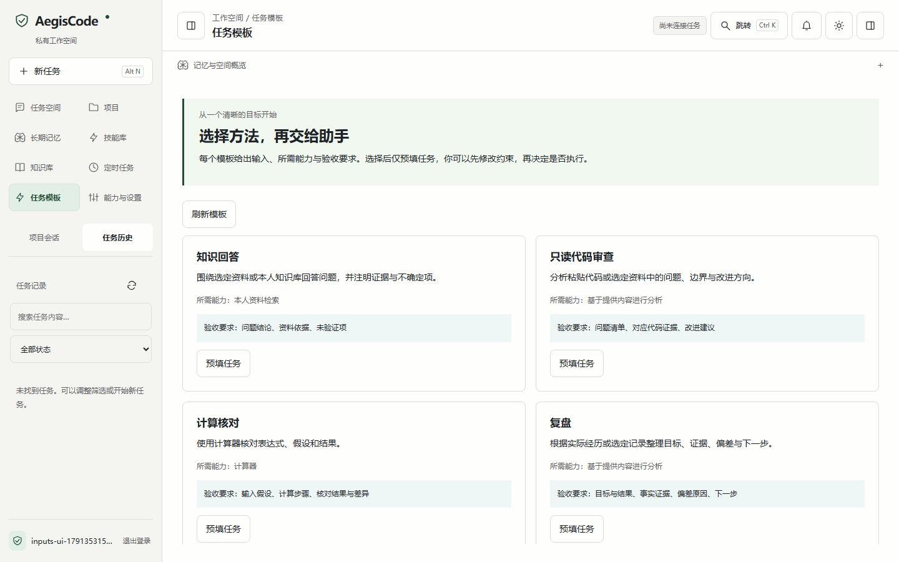

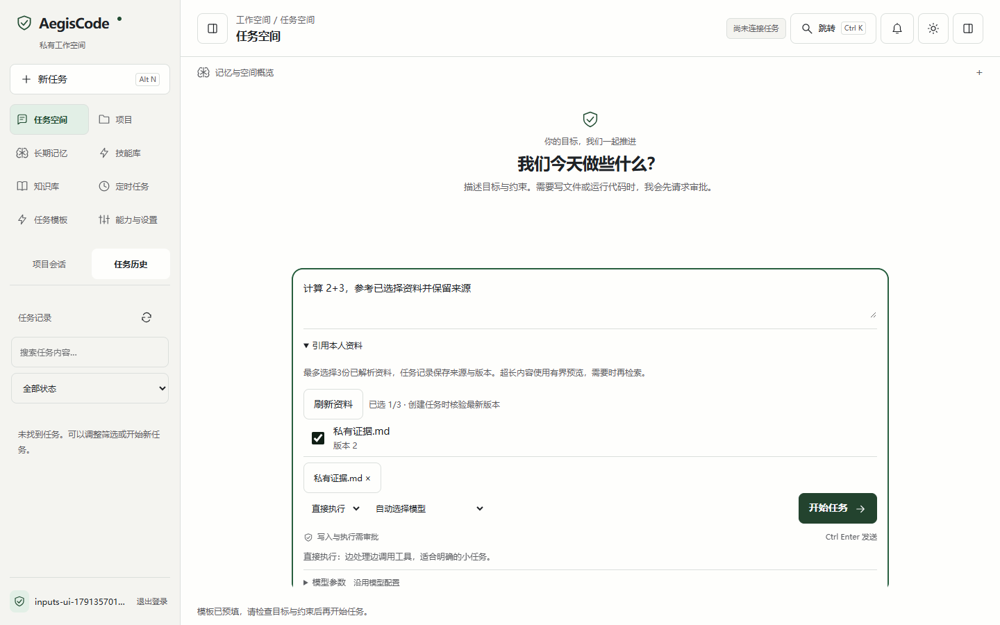

能力与设置中的MCP导览只展示本人授权配置；“配置就绪”不表示外部服务已连接。操作步骤见[模板、资料与外部工具指南](任务模板与资料引用指南.md)。

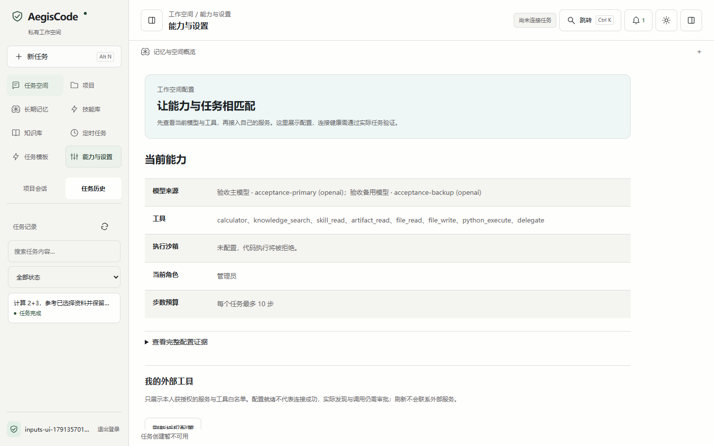

## 11. 调整任务模型参数

输入区选择来源后展开「模型参数」，按声明能力调整温度、输出上限与推理强度；自动选择只提供共同能力。切换来源后检查保留数值，失败保留输入，新任务重置。截图来自真实HTTP与确定性模型；参数声明不证明商业模型连通。详见[模型参数指南](模型参数使用指南.md)。

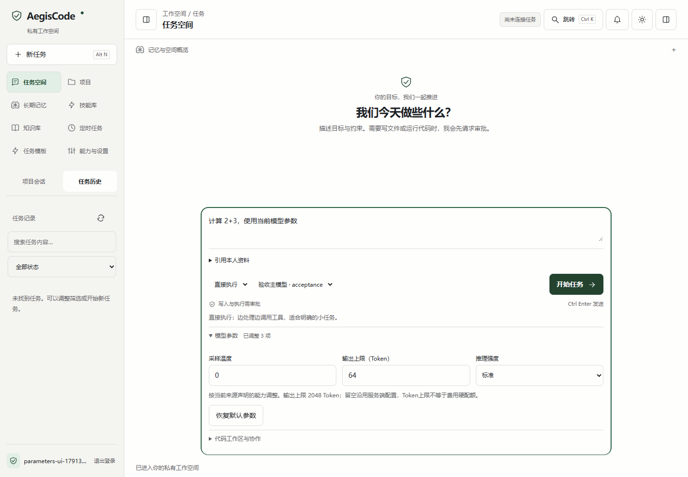

## 12. 查看真实模型片段

当前源码在最终结果保存前展示独立预览，并明确标注尚未验收；调用工具时撤销，任务结束后展示保存的答复。文本分批持久化，刷新只重读原任务。截图来自真实HTTP与确定性延迟模型，详见[增量输出指南](真实模型增量输出指南.md)。

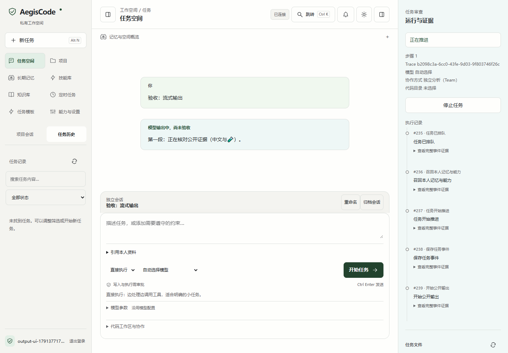

## 13. 审阅拟写文件，核对保存版本

当前源码在file_write审批区展示新建／修改、差异、原文件版本与前后对照。批准仅绑定本次拟写内容与冻结基线；审批期间文件变化时拒绝覆盖。截断时展开完整工具参数，不执行文本中的HTML。截图来自独立数据库与真实HTTP，模型为确定性验收替身。

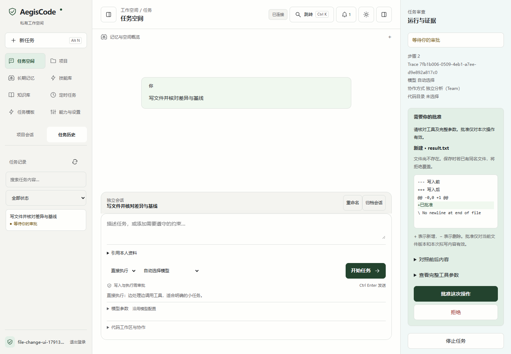

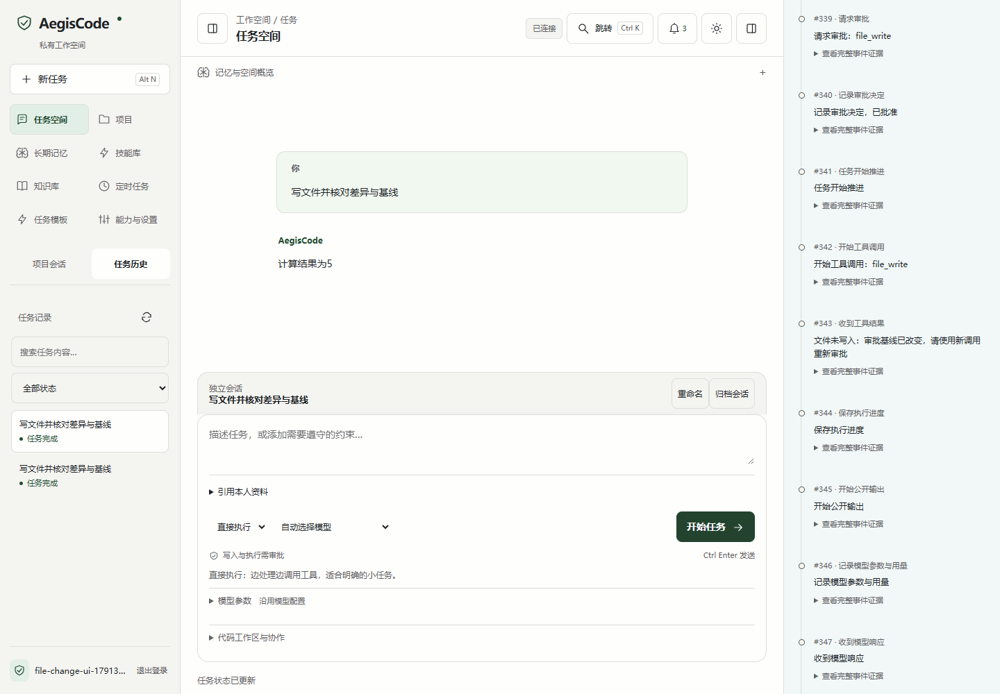

操作步骤和取消边界见[文件审阅指南](文件差异审阅指南.md)。这不是通用编辑器或自动补丁合并。

## 14. 逐步查看计划与验收来源

当前源码选择「先规划（Plan）」后，审查区显示节点状态、必需工具和来源。展开步骤核对验收原因；刷新保持同一任务，不能把最终完成状态当作所有步骤正确的证明。下图来自真实本机HTTP、独立数据库及确定性模型，公开0.2.9安装包尚不包含此增量。

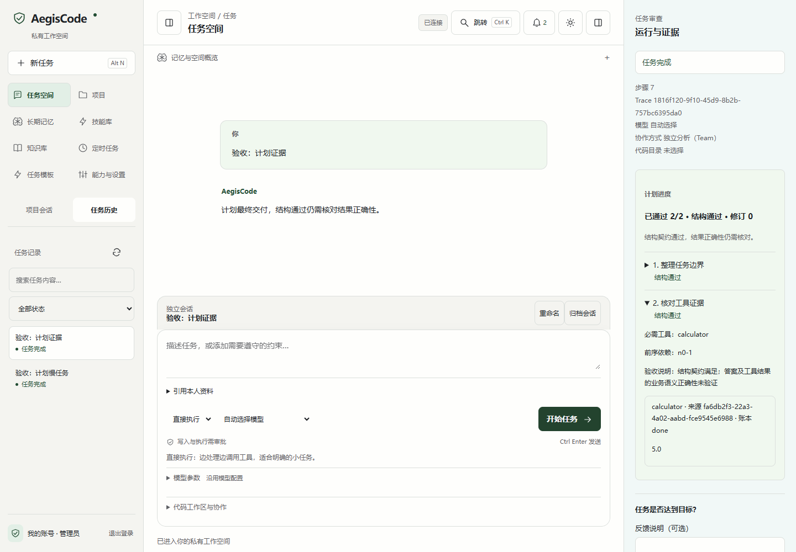

重规划保留已完成前缀，旧的未完成步骤进入归档；归档可展开检查缺少的证据。拒绝审批、预算不足或结果未知仍会保留未通过进度。

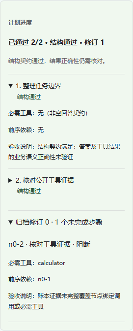

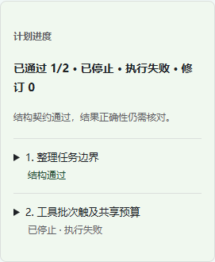

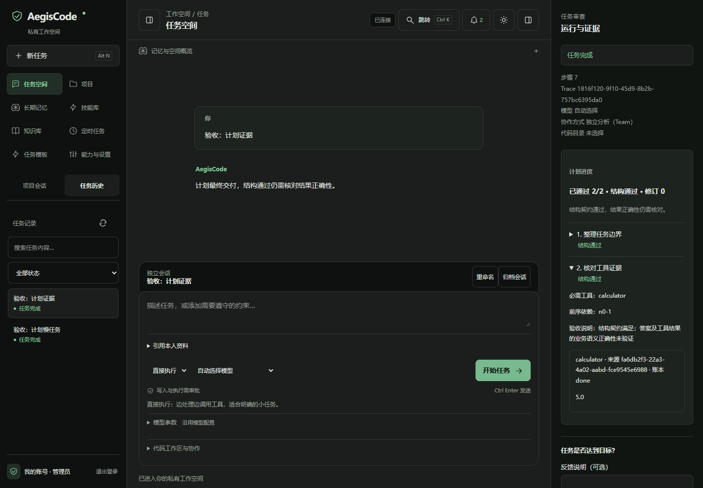

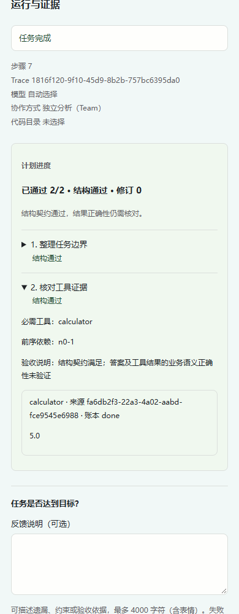

使用方法见[计划执行指南](计划执行使用指南.md)。这些截图用于说明交互和证据边界，不表示真实供应商任务成功率或生产性能。

## 15. 审阅失败反馈生成的技能修订草稿

当前源码在终态任务审查区提供“反馈说明（可选）”，最多4000个Unicode字符。保存失败保留说明和就近错误；同一任务重读，或进入技能库后返回该任务，仍保留未提交说明和有效错误。成功保存、切换任务、开始新任务、退出或换账号时清空，旧响应不能覆盖新任务或同任务新代次的说明。公开0.2.9安装包尚不包含本节源码增量。

技能库仅为符合服务端来源契约的候选标注“修订草稿”和“基于原技能vN，未验证建议”。展开“对照原技能”才读取本人原技能；ID、活动状态、版本和来源一致时并排显示原文与建议。来源或版本改变时提示“原技能已变化”，不冒充历史正文。草稿不会自动启用、替换原技能或批准工具操作；召回也不证明实际使用或失败因果。

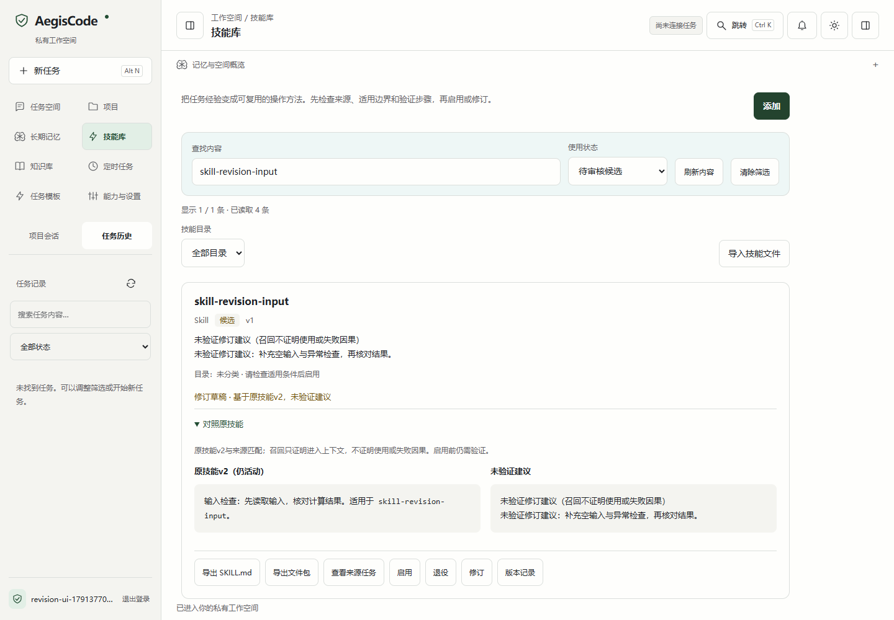

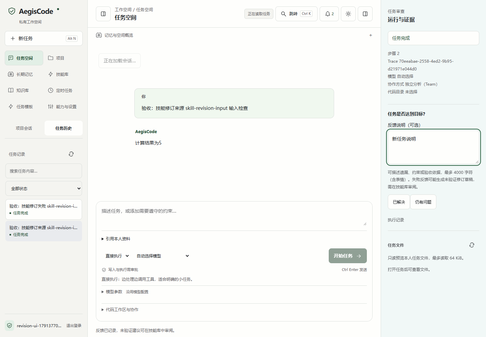

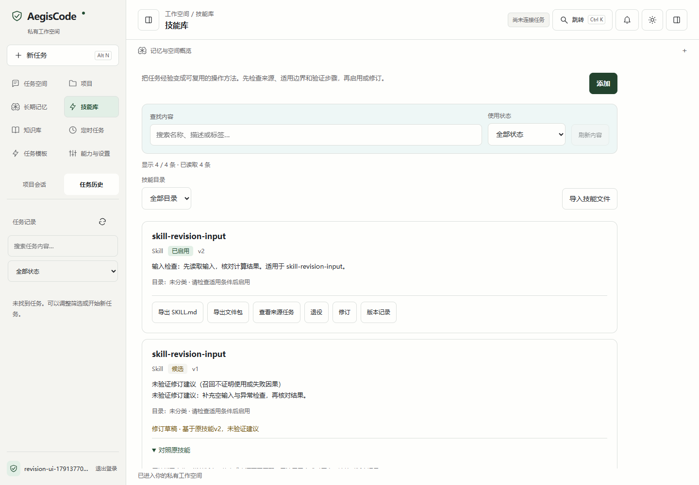

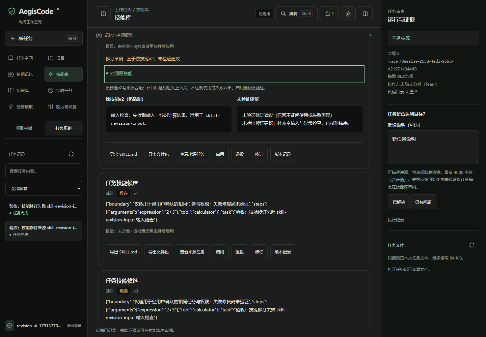

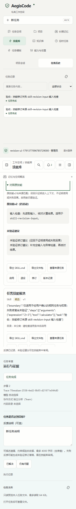

本节真实对照截图来自独立本机HTTP：工具执行、经验提炼、人工启用、真实召回及失败反馈生成私有草稿。来源变化截图是明确的浏览器响应故障注入；模型为确定性协议夹具，未证明外部真实模型的修订质量。九张截图的来源、深浅390／768／1440布局及复现命令见[修订截图导览](截图/技能修订/截图导览.md)，完整步骤见[技能反馈修订指南](技能反馈修订指南.md)。

0.2.9下载包已包含新版布局、内容管理、连续问答、项目多会话、通知、定时任务、任务模板、私有资料引用、MCP导览、模型参数，以及真实增量预览和文件差异审阅。安装与公开下载已核验，见[发布记录](升级方案/33-零点二九安装与公开发布验收.md)。尚无通用编辑器或自动PR／合并；后续Skill轻量投影仅主分支源码提供。
