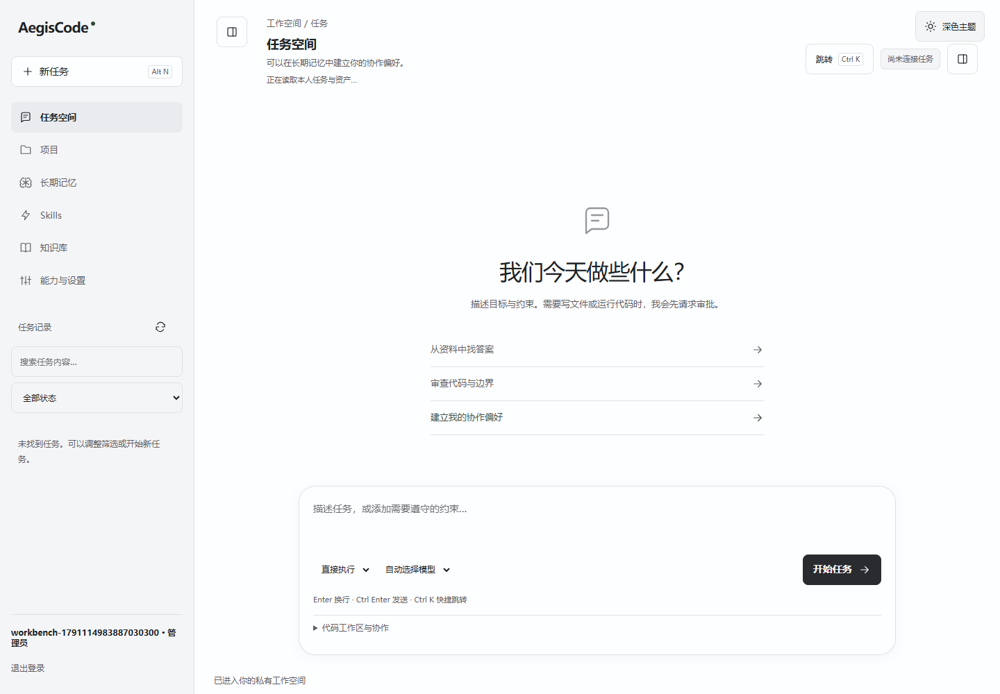
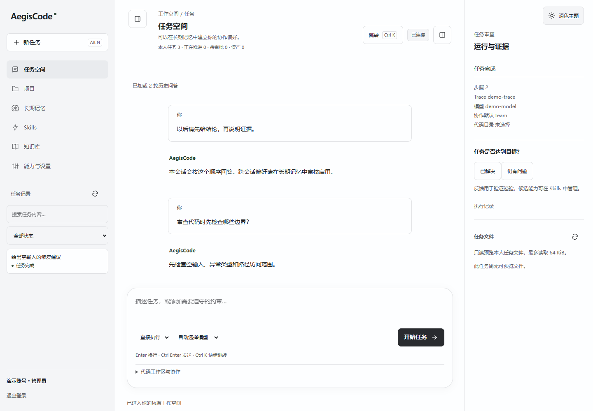
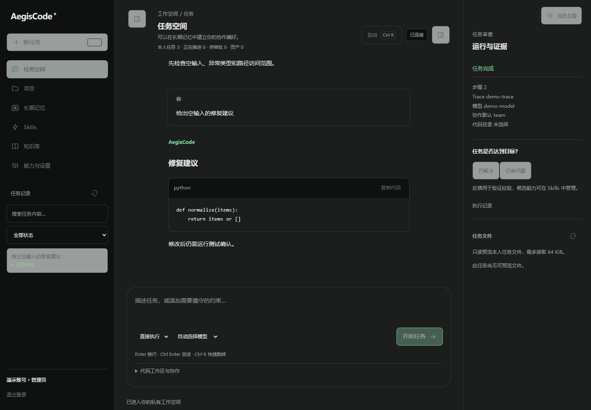
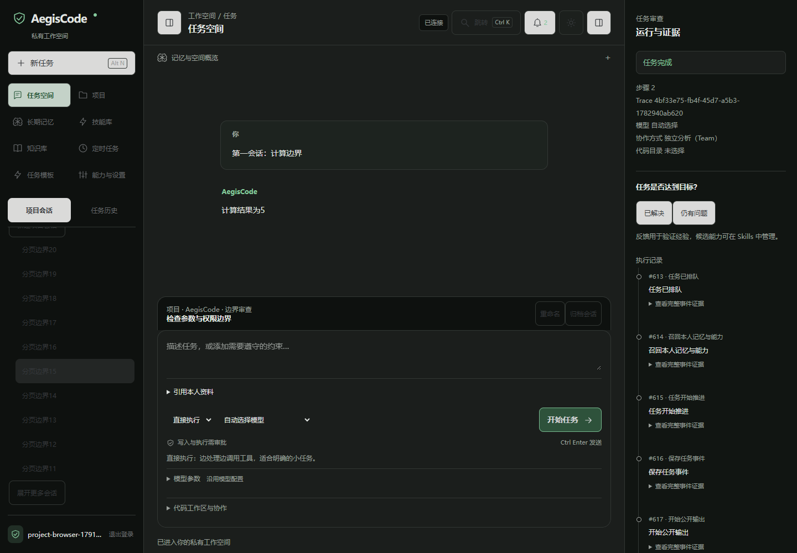
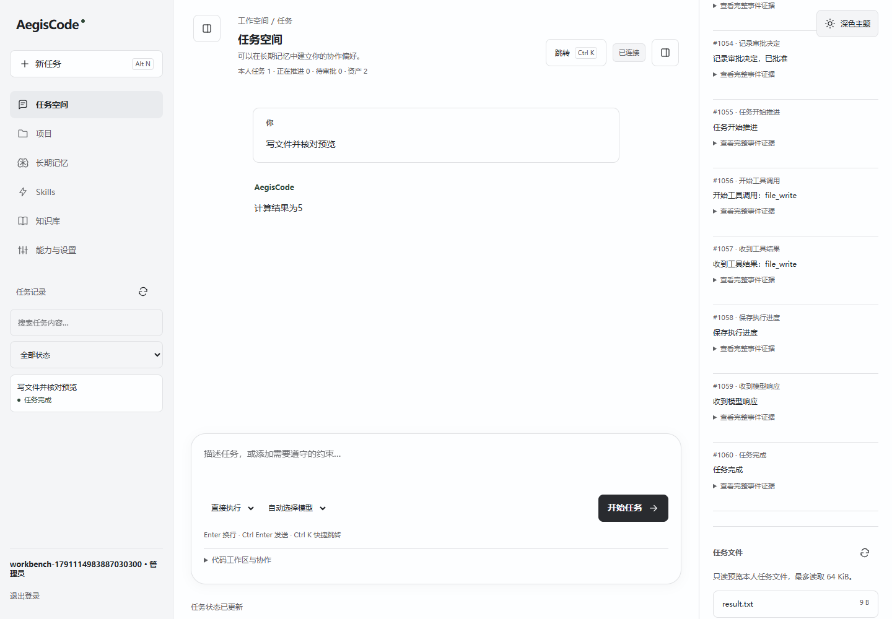
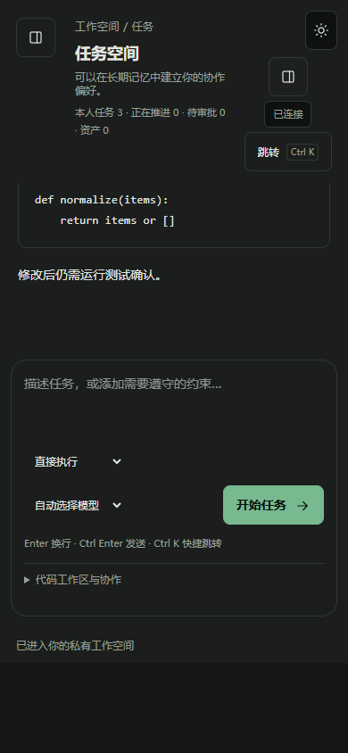
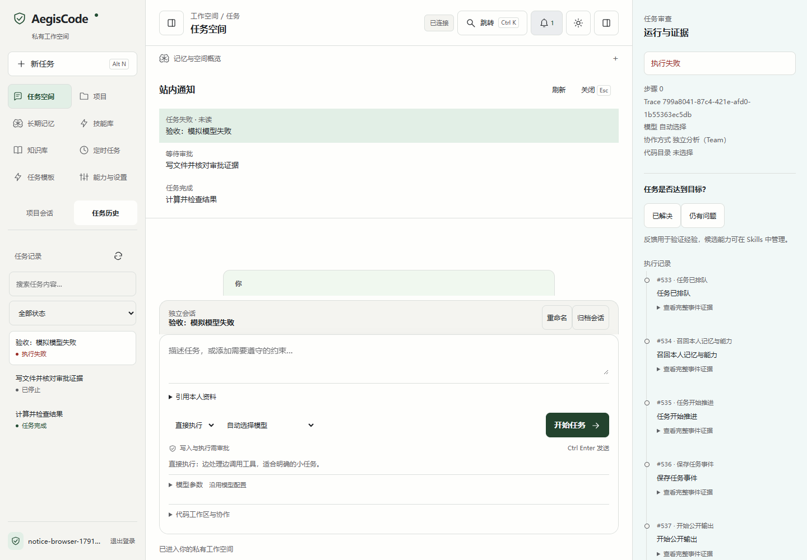

# AegisCode 截图使用导览

先从 [README 安装入口](../README.md#安装与启动) 选择 Windows 安装器、便携版、Python 或 Docker。静态页面随安装包提供，运行界面不需要 Node.js；调用模型需要配置自己的模型服务。

## 1. 进入私有工作台

登录后从左侧新任务开始，描述目标、约束和验收标准。任务列表支持搜索、状态筛选和分页。截图来自独立验收账号与确定性模型，不含真实业务数据。

## 2. 连续提问并阅读代码

当前源码在打开任务时加载历史问答，可分页回看。同一会话继续提问会产生新的可追踪任务；页面历史与模型上下文预算分别管理。截图为明确的界面夹具，不证明生成代码已经执行成功。

## 3. 在项目中分开讨论目标

同一项目可创建多个独立会话，分别处理权限、性能与测试。底部标签显示当前项目和会话；支持重命名、归档和恢复。旧库先按[使用指南](项目会话使用指南.md)备份迁移。下图来自独立数据库与确定性模型的真实HTTP验收。

## 4. 检查工具操作与任务文件

需要写文件、执行代码或调用外部工具时，核对工具名和完整参数后批准。文件面板用于只读查看执行证据；缺少 Docker 沙箱时不会回退宿主执行。下图来自独立确定性工作台验收。

## 5. 把工作经验变成可复用技能

任务反馈触发候选提炼，先审核来源、适用边界和工具需求再启用。在 Skills 中按目录管理，导入或导出 SKILL.md，修订版本并退役不再适用的技能。个人偏好和约束在长期记忆中审核启用，登录与后续任务可加载。下图来自独立 Skill 验收账号。

## 6. 分工执行，同时核对证据

输入区选择 Fork／Team；绑定仓库后可选择代码副本或 Worktree。主控最多委派两个只读子任务。图中测试夹具故意缺少必要工具证据，独立验收拒绝通过并阻断后继，展示失败边界。

## 7. 接入自己的模型

在能力与设置中选择协议，生成配置示例，填写密钥环境变量名称。管理员将示例写入服务端环境并重启，实际连通性需调用验证。下图为配置交互夹具，不表示 Azure 服务已连通。

## 8. 窄屏查看和处理任务

窄屏可折叠导航与审查区，保留输入区。需要审批时展开审查区核对完整操作；本页移动截图为历史问答界面夹具。

## 9. 从通知定位任务

顶部铃铛查看本人的完成、失败和审批提醒，点击标记已读并定位任务，审批仍需单独决定。下图来自真实HTTP与确定性模型验收；故障注入验证了读取失败后重试和保留已有列表。详情见[通知使用指南](站内通知使用指南.md)。

0.2.6下载包已包含连续问答、项目多会话、站内通知与启动改进。定时任务、输入附件、模板探索、编辑器、差异审阅和逐Token模型流仍在规划中，不能将界面外观视为这些能力已完成。
