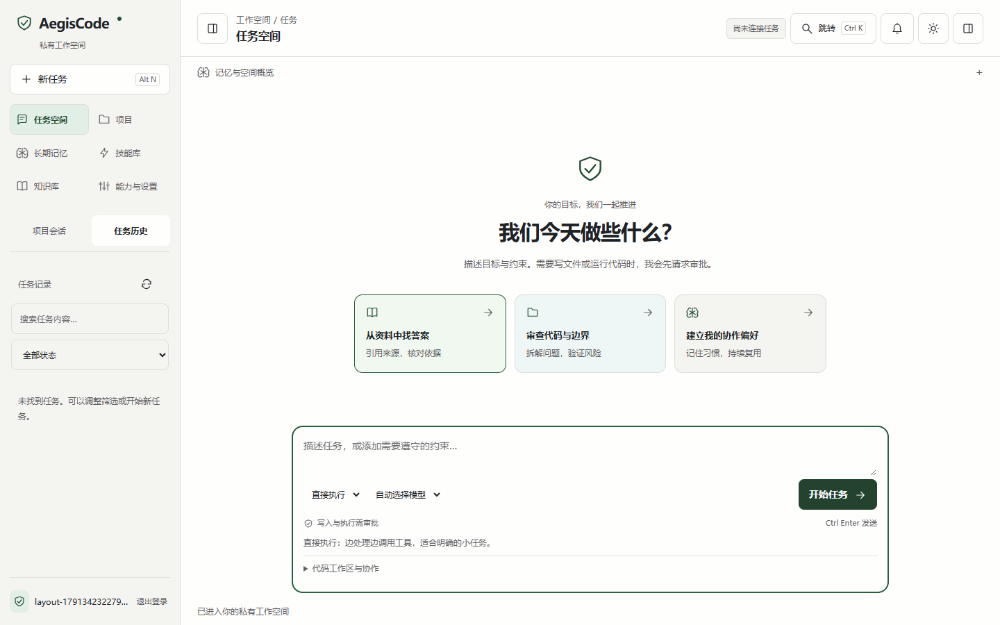
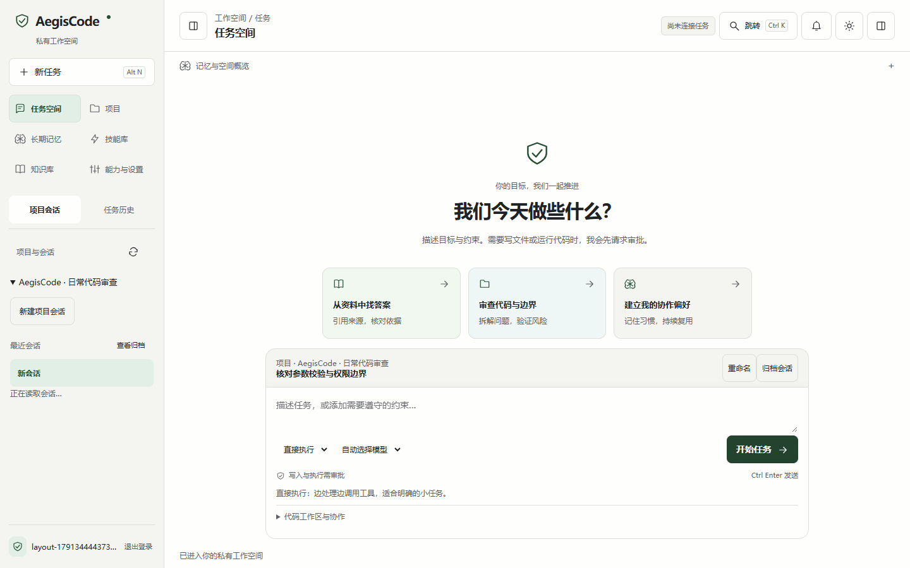
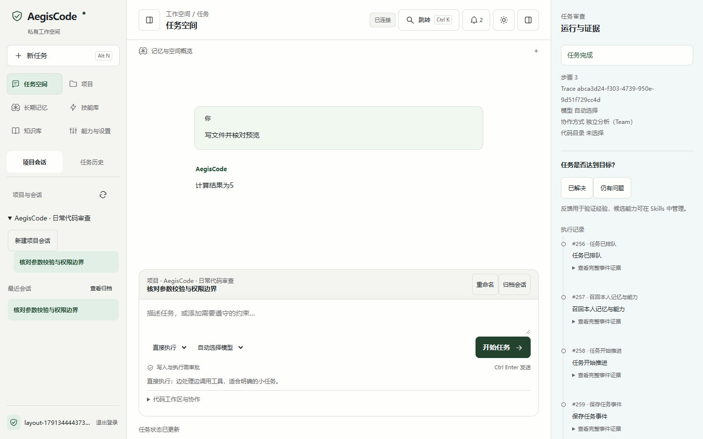
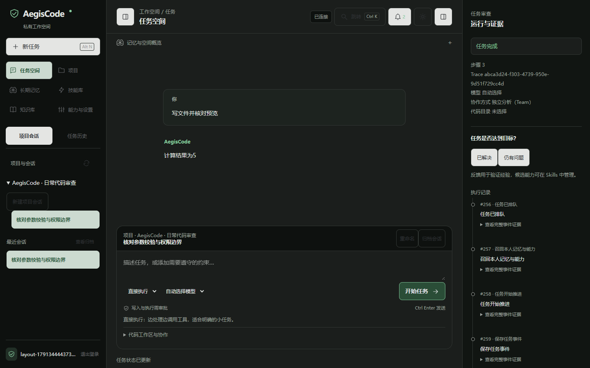
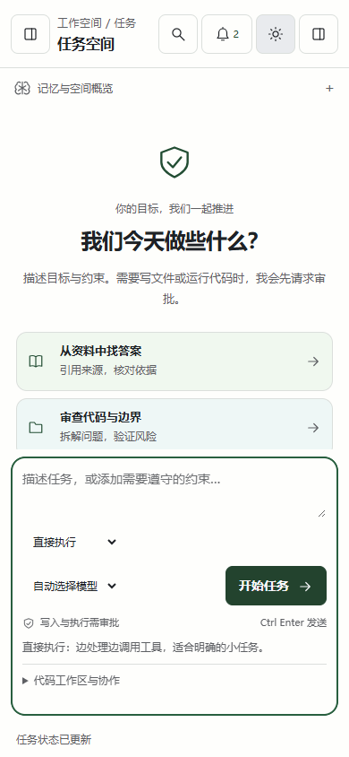

# 新版工作台指南

当前源码使用 TypeScript + Vite、HTML/CSS。公开 [0.2.7 下载包](https://github.com/doinb666/AegisAgent/releases/tag/v0.2.7)已包含下面的新版布局，以及[内容管理优化](内容管理指南.md)；Web 与 EXE 共用同一套工作台。

## 从目标开始

输入你的目标与约束，点击「开始任务」，或按 `Ctrl Enter`。三个建议入口只填入示例，不会自动发送。直接执行适合明确的小任务；先规划适合多步骤目标；审查回答用于质量复核。切换模式时，下方说明同步更新。模型列表来自服务端实际配置，「自动选择模型」使用服务端路由与兜底。

## 找到项目和旧任务

侧栏「项目会话」展开项目后可新建独立会话；同一项目下的会话分别保留上下文。当前会话高亮，刷新保留项目展开状态。输入区上方显示项目、会话名、重命名和归档操作。

「任务历史」按内容搜索或按状态筛选，点击任务查看问答与执行证据。长列表独立滚动，账号与退出入口保留在底部。「查看归档」用于找到已归档会话，恢复后才能继续发送。

## 理解记忆、技能和审查

- 长期记忆：保存个人偏好、约束与经验；候选先审阅，再启用。
- 技能库：管理可复用操作方法，查看边界、资源和版本；可以修订或退役。
- 知识库：上传本人资料，为问答提供检索来源。
- 记忆与空间概览：查看已加载记忆和任务统计，展开后读取。
- 顶部铃铛：查看本人完成、失败和审批提醒，点击定位任务。
- 右侧面板按钮：展开运行状态、工具审批、执行记录和只读文件。

批准前核对工具与完整参数。消息或经验里的约束不会扩大实际权限；点击通知不会自动审批。协作和代码目录准备仍在输入区「代码工作区与协作」中，界面解释 Fork、Team 和 Worktree 的用途，服务端决定可用范围。

## 深色、窄屏与快捷键

顶部太阳按钮切换主题；窄屏默认收起侧栏，点击左上按钮展开。`Ctrl K`（macOS 为 `Cmd K`）搜索入口，方向键选择、Enter 打开、Escape 关闭；搜索「搜索任务」会自动切换历史列表并定位输入。`Alt N` 开始新任务，Enter 在输入框中换行。

截图来自独立临时数据库、真实 HTTP 链路和确定性测试模型，用于验证交互与布局，不证明商业模型回答质量。
